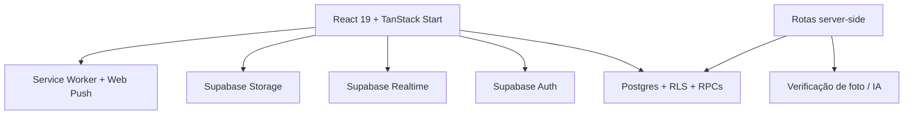
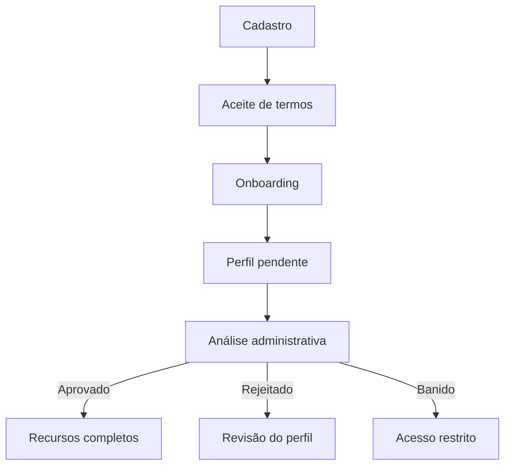
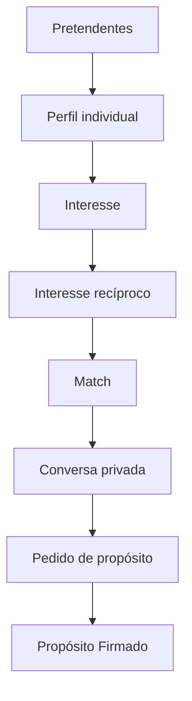

# VaiDarNamoro — Manual do Sistema Atual

## Item 1 — Congelamento e documentação do comportamento existente

**Repositório:** `tonyrodrigues98/vaidarnamorocristao`  
**Branch analisada:** `main`  
**Commit congelado:** `7fb5c9747aa5afa26132407958bbf5ab68c83c5c`  
**Data do congelamento:** 22 de julho de 2026  
**Natureza deste trabalho:** auditoria documental, sem alterações no produto  
**Estado:** versão 1.0 do retrato funcional atual

---

## 1. Finalidade deste documento

Este manual registra como o VaiDarNamoro funciona antes da futura reestruturação. Ele deve ser usado como:

- referência para comparar o sistema atual com o futuro;
- contrato de preservação de dados, regras e funcionalidades;
- inventário de jornadas, páginas, permissões e dependências;
- base para classificar cada área como **preservar**, **redesenhar**, **refatorar** ou **substituir**;
- proteção contra perdas acidentais durante mudanças de arquitetura e design.

Este documento descreve o que existe. Ele não aplica correções, migrations, redesigns ou mudanças de regras.

### 1.1 Como interpretar as evidências

| Marcação                   | Significado                                                                          |
| -------------------------- | ------------------------------------------------------------------------------------ |
| Confirmado no código       | Comportamento diretamente encontrado em rotas, componentes, serviços ou SQL          |
| Confirmado por build/teste | Comportamento estrutural validado pela instalação, compilação ou testes existentes   |
| Dependente do ambiente     | Requer credenciais, dados ou políticas do Supabase publicado para validação integral |
| Destino preliminar         | Classificação inicial; ainda depende da decisão de produto de Antonio                |

---

## 2. Retrato executivo

O VaiDarNamoro atual é um monólito modular de produto social cristão. O namoro é o fluxo central histórico, mas o sistema também possui comunidade, espiritualidade, economia virtual, pets, jogos, avatar, personalização, moderação e administração.

### 2.1 Escala atual

| Indicador                       |       Estado congelado |
| ------------------------------- | ---------------------: |
| Arquivos em `src`               |                    595 |
| Componentes React               |                    207 |
| Rotas de aplicação/API          |                     65 |
| Bibliotecas e serviços internos |                     79 |
| Migrations Supabase             |                    196 |
| Tabelas tipadas                 |                    140 |
| Views tipadas                   |                      3 |
| Funções/RPCs tipadas            |                    201 |
| Linhas TypeScript/TSX           | aproximadamente 96.700 |
| Linhas SQL                      | aproximadamente 21.900 |
| Tamanho do repositório          | aproximadamente 463 MB |

### 2.2 Arquitetura resumida

### 2.3 Princípio técnico dominante

A maior parte do produto consulta o Supabase diretamente no navegador. O frontend controla experiência, carregamento, cache e Realtime; o banco controla segurança e operações críticas por RLS, triggers e RPCs.

Isso permitiu crescimento rápido, mas criou três consequências:

1. páginas grandes concentram UI, consulta e regra de negócio;
2. regras importantes aparecem distribuídas entre React e SQL;
3. uma mudança visual pode afetar comportamento se o código for substituído sem mapear dependências.

---

## 3. Camada global do aplicativo

### 3.1 Inicialização

A raiz da aplicação monta, nesta ordem lógica:

- cliente TanStack Query;
- tema claro/escuro;
- autenticação;
- presença online;
- ponte de notificações Realtime;
- bloqueio global de usuários banidos/rejeitados;
- aviso de rede;
- convite de instalação PWA;
- shell mobile;
- rota atual;
- rodapé institucional quando permitido;
- toasts globais.

Também registra o Service Worker e remove a splash screen após a hidratação inicial.

### 3.2 Navegação mobile

A bottom navigation possui cinco destinos fixos:

1. Início;
2. Devocional;
3. Conversas;
4. Pretendentes;
5. Perfil.

O item Perfil tenta exibir a foto real do usuário; sem foto, usa iniciais. Chats privados focados escondem a bottom nav. A comunidade global mantém a navegação.

### 3.3 Páginas com experiência de aplicativo

O shell mobile é ativado para áreas autenticadas como `/inicio`, `/devocional`, `/pretendentes`, `/conversas`, `/perfil`, `/loja`, `/notificacoes`, `/dashboard`, `/interesses`, `/matches`, `/recados`, `/oracoes`, `/conta`, `/bloqueados`, `/verificacao` e `/proposito`.

Não é ativado em landing page, autenticação, admin, onboarding, suporte, termos e manual.

### 3.4 Chat e teclado mobile

Rotas `/conversas/*` usam a altura real do `visualViewport`. O sistema reage a abertura do teclado, mudança de orientação, foco em input/textarea e alterações tardias do Safari iOS. Essa lógica é parte funcional do chat e precisa ser preservada em qualquer redesign.

---

## 4. Autenticação, cargos e acesso

### 4.1 Estado carregado no login

O contexto de autenticação mantém:

- usuário e sessão Supabase;
- cargo principal;
- cor do badge;
- opção de aparecer publicamente;
- permissão de agente de suporte;
- status do perfil;
- indicador de aprovação;
- estado de carregamento dos cargos.

### 4.2 Hierarquia de cargos

1. `super_admin`;
2. `admin`;
3. `apresentador`;
4. `moderador`;
5. `user`.

O primeiro cargo encontrado nessa prioridade vira o cargo principal apresentado pela interface.

### 4.3 Estados do perfil

| Estado     | Efeito principal                                                              |
| ---------- | ----------------------------------------------------------------------------- |
| `pending`  | Acesso a áreas básicas; recursos protegidos redirecionam para `/dashboard`    |
| `approved` | Acesso normal às áreas protegidas                                             |
| `rejected` | Acesso limitado, mas ainda pode editar `/perfil`                              |
| `banned`   | Acesso restrito a início, notificações, conta, suporte, termos, manual e auth |

Equipe (`super_admin`, `admin`, `apresentador`, `moderador`) é tratada como aprovada.

### 4.4 Exclusão administrativa

O aplicativo acompanha em Realtime a remoção do próprio registro em `profiles`. Se o perfil for excluído por um administrador, a sessão é encerrada automaticamente.

### 4.5 Matriz resumida de acesso

| Área                                 | Visitante | Autenticado não aprovado | Aprovado |                  Staff/Admin |
| ------------------------------------ | --------: | -----------------------: | -------: | ---------------------------: |
| Landing, sobre, termos, manual       |       Sim |                      Sim |      Sim |                          Sim |
| Login/cadastro/recuperação           |       Sim |                      Sim |      Sim |                          Sim |
| Início, conta, notificações, suporte |       Não |                      Sim |      Sim |                          Sim |
| Perfil próprio                       |       Não | Sim, inclusive rejeitado |      Sim |                          Sim |
| Pretendentes, interesses, matches    |       Não |                      Não |      Sim |                          Sim |
| Chat privado e comunidade            |       Não |                      Não |      Sim |                          Sim |
| Recados, orações, verificação        |       Não |                      Não |      Sim |                          Sim |
| Administração                        |       Não |                      Não |      Não | Conforme cargo e regra local |

**Dependência crítica:** bloqueios visuais não substituem RLS. A autorização real precisa continuar garantida no banco.

---

## 5. Jornadas principais atuais

### 5.1 Entrada de um novo usuário

### 5.2 Jornada romântica

### 5.3 Jornada de personalização

O usuário ganha ou compra moedas, adquire itens na loja, guarda itens em inventários e equipa moldura, aura, fundo, gradiente, avatar ou elementos relacionados ao pet. O perfil e diferentes componentes visuais consultam esses equipamentos.

### 5.4 Jornada comunitária e espiritual

O usuário aprovado pode conversar no chat global, reagir e comentar devocionais, compartilhar pedidos de oração, fazer o quiz bíblico, acompanhar notícias e receber notificações dessas interações.

---

## 6. Inventário funcional de rotas

### 6.1 Públicas e institucionais

| Rota                    | Comportamento atual                                |
| ----------------------- | -------------------------------------------------- |
| `/`                     | Landing page pública e porta de entrada do produto |
| `/como-funciona`        | Explicação institucional do fluxo                  |
| `/sobre`                | Conteúdo institucional                             |
| `/depoimentos`          | Depoimentos apresentados publicamente              |
| `/blog` e `/blog/$slug` | Índice e leitura de artigos                        |
| `/termos`               | Termos de uso                                      |
| `/manual`               | Manual do usuário dentro do produto                |
| `/instalar`             | Orientação de instalação PWA                       |

### 6.2 Autenticação e onboarding

| Rota                    | Comportamento atual                     |
| ----------------------- | --------------------------------------- |
| `/auth/login`           | Login e redirecionamento de sessão      |
| `/auth/signup`          | Cadastro e registro do aceite de termos |
| `/auth/forgot-password` | Solicitação de recuperação              |
| `/auth/reset-password`  | Redefinição de senha                    |
| `/onboarding`           | Fluxo principal de 12 etapas            |
| `/onboarding/etapa-1`   | Compatibilidade/legado de etapa         |
| `/onboarding/etapa-2`   | Preferências/legado de etapa            |

### 6.3 Núcleo autenticado

| Rota            | Comportamento atual                                                                |
| --------------- | ---------------------------------------------------------------------------------- |
| `/inicio`       | Hub diário, estado da conta, atalhos e atividade                                   |
| `/dashboard`    | Métricas, gráficos, status e painel analítico; é legítimo e separado de `/inicio`  |
| `/perfil`       | Perfil próprio, edição, preferências, visual, saldo, presentes, conquistas e papel |
| `/conta`        | Configurações de conta, tema, segurança, suporte, sessão e zona de perigo          |
| `/notificacoes` | Central de atividades e notificações                                               |
| `/verificacao`  | Solicitação e acompanhamento de verificação                                        |
| `/bloqueados`   | Lista e desbloqueio de pessoas                                                     |

### 6.4 Namoro e relacionamento

| Rota                  | Comportamento atual                               |
| --------------------- | ------------------------------------------------- |
| `/pretendentes`       | Descoberta, filtros, afinidade e agrupamentos     |
| `/pretendentes/$id`   | Perfil público romântico e ações de interação     |
| `/interesses`         | Interesses recebidos/enviados e retribuição       |
| `/matches`            | Matches existentes e desfazer match               |
| `/conversas`          | Lista de conversas privadas e acesso à comunidade |
| `/conversas/$matchId` | Chat privado Realtime                             |
| `/proposito/$matchId` | Área do casal e gestão do compromisso             |
| `/recados`            | Mensagens anônimas, dicas, resposta e revelação   |
| `/presentes`          | Catálogo/envio e presentes recebidos              |

### 6.5 Comunidade e conteúdo cristão

| Rota                    | Comportamento atual                                   |
| ----------------------- | ----------------------------------------------------- |
| `/comunidade`           | Redirect legado para a experiência comunitária atual  |
| `/conversas/comunidade` | Chat global comunitário em tempo real                 |
| `/devocional`           | Posts, reações, oração, comentários e moderação       |
| `/oracoes`              | Pedidos comunitários de oração                        |
| `/quiz-biblico`         | Quiz diário obtido por RPC                            |
| `/noticias`             | Notícias/reflexões/avisos publicados em `daily_posts` |

### 6.6 Economia, customização e jogos

| Rota            | Comportamento atual                            |
| --------------- | ---------------------------------------------- |
| `/loja`         | Compra, inventário e equipamento visual        |
| `/caixas`       | Sistema de caixas/prêmios                      |
| `/conquistas`   | Conquistas do usuário e do pet                 |
| `/avatar`       | Editor, loja, inventário e looks do avatar     |
| `/avatar/criar` | Criação inicial do avatar                      |
| `/meu-pet`      | Criação, cuidado, progressão e ambiente do pet |
| `/pet-arcade`   | Hub de jogos ligados ao pet                    |

### 6.7 Suporte e administração

| Rota                               | Comportamento atual                |
| ---------------------------------- | ---------------------------------- |
| `/suporte`                         | Tickets do usuário                 |
| `/suporte/$id`                     | Conversa e anexos de um ticket     |
| `/suporte/ajuda`                   | Base de artigos de ajuda           |
| `/admin`                           | Painel administrativo central      |
| `/admin/fotos`                     | Moderação e reparo de fotos        |
| `/admin/verificacoes`              | Pedidos de verificação             |
| `/admin/economia`                  | Economia e concessões              |
| `/admin/presentes`                 | Catálogo de presentes              |
| `/admin/molduras` e `/admin/auras` | Catálogo de decorações             |
| `/admin/fundos`                    | Fundos de perfil                   |
| `/admin/gradientes-nome`           | Gradientes de nome                 |
| `/admin/stickers`                  | Categorias e stickers              |
| `/admin/avatar`                    | Catálogo do avatar                 |
| `/admin/pets`                      | Ecossistema de pets e Pet Arcade   |
| `/admin/equipe-live`               | Equipe e destaques mensais da live |

---

## 7. Fichas dos módulos

## 7.1 Landing e conteúdo institucional

| Campo                | Registro atual                                                                                                          |
| -------------------- | ----------------------------------------------------------------------------------------------------------------------- |
| Estado atual         | Área pública de aquisição, explicação, depoimentos, blog e instalação                                                   |
| Dependências         | Rotas públicas, assets, metadados SEO, PWA e conteúdos locais/remotos                                                   |
| Regras críticas      | Não exigir login; manter entrada para auth; preservar SEO e instalação                                                  |
| Problemas observados | Metadados possuem descrições e imagens OG duplicadas; identidade ainda posiciona o produto prioritariamente como namoro |
| Destino preliminar   | Redesenhar e reposicionar para comunidade + namoro                                                                      |
| Risco                | Médio, por impacto em aquisição, SEO e primeira impressão                                                               |

## 7.2 Cadastro e onboarding

O onboarding atual possui 12 etapas:

1. nome;
2. nascimento;
3. sexo;
4. foto;
5. localização;
6. altura;
7. estado civil;
8. biografia;
9. fé e igreja;
10. rotina espiritual;
11. objetivo e ritmo;
12. preferências.

| Campo                | Registro atual                                                                                                     |
| -------------------- | ------------------------------------------------------------------------------------------------------------------ |
| Estado atual         | Fluxo guiado com rascunho local e gravação em múltiplas estruturas                                                 |
| Dependências         | `profiles`, `profile_advanced`, `profile_preferences`, Storage de fotos, termos                                    |
| Regras críticas      | Primeiras etapas formam perfil básico; foto passa por normalização/moderação; preferências alimentam Pretendentes  |
| Problemas observados | Onboarding serve simultaneamente conta, namoro e identidade comunitária; esses conceitos ainda não estão separados |
| Destino preliminar   | Refatorar regra e redesenhar experiência                                                                           |
| Risco                | Alto, pois erros bloqueiam entrada e contaminam os dados-base do usuário                                           |

## 7.3 Início

| Campo                | Registro atual                                                                                                                 |
| -------------------- | ------------------------------------------------------------------------------------------------------------------------------ |
| Estado atual         | Hub de boas-vindas contextual por horário, situação de aprovação e atividade                                                   |
| Dependências         | Perfil, perfil avançado, preferências, fotos, posts, solicitações administrativas, avisos, apelações, conversas e notificações |
| Regras críticas      | CTA muda conforme pendência, rejeição, banimento, completude e aprovação                                                       |
| Problemas observados | Concentra muitas responsabilidades e consultas; mistura estado operacional com descoberta de conteúdo                          |
| Destino preliminar   | Preservar função, redesenhar e dividir internamente                                                                            |
| Risco                | Alto, pois é o hub principal após login                                                                                        |

## 7.4 Dashboard

| Campo                | Registro atual                                                                                            |
| -------------------- | --------------------------------------------------------------------------------------------------------- |
| Estado atual         | Centro analítico com visualizações, interesses, matches, não lidas, visitantes e distribuição etária      |
| Dependências         | `profiles`, `profile_views`, `interests`, `matches`, `messages`, `daily_posts`, Recharts e TanStack Query |
| Regras críticas      | `/dashboard` é uma rota legítima e independente; filtros de 7, 30, 90 dias e tudo alteram métricas reais  |
| Problemas observados | Métricas dependem da disponibilidade/qualidade dos dados registrados e de consultas agregadas no cliente  |
| Destino preliminar   | Preservar e redesenhar somente quando necessário                                                          |
| Risco                | Médio                                                                                                     |

## 7.5 Perfil próprio

O perfil atual contém:

- cabeçalho visual e foto decorada;
- dados básicos;
- fotos adicionais;
- história/biografia;
- informações avançadas e espirituais;
- preferências românticas;
- customização visual;
- saldo e histórico de moedas;
- presentes recebidos;
- missões, badges e conquistas;
- configurações de cargo para staff;
- opção de visibilidade em Pretendentes.

| Campo                | Registro atual                                                                                                                                    |
| -------------------- | ------------------------------------------------------------------------------------------------------------------------------------------------- |
| Estado atual         | Grande página multifuncional com abas e edição inline                                                                                             |
| Dependências         | `profiles`, `profile_preferences`, `user_roles`, `user_badges`, fotos, moderação, decorações, fundos, gradientes, presentes, moedas, XP e missões |
| Regras críticas      | Itens equipados precisam permanecer sincronizados; edições não podem perder inventário; staff possui controles adicionais                         |
| Problemas observados | Arquivo acima de 1.700 linhas; identidade, configurações, inventário e perfil romântico estão misturados                                          |
| Destino preliminar   | Redesenhar profundamente no estilo de perfil modular/customizável; refatorar sem perder regras                                                    |
| Risco                | Crítico para a reestruturação, por ser o principal ponto de integração visual                                                                     |

## 7.6 Pretendentes e perfil individual

A listagem atual:

- exige aprovação;
- seleciona sexo oposto;
- exclui bloqueios nos dois sentidos;
- exclui staff oculto da listagem;
- exclui usuários em compromisso ativo;
- consulta informações avançadas e preferências;
- calcula afinidades em comum;
- agrupa mais compatíveis, próximos e novos;
- suporta filtros de perfil.

As ações primárias do perfil individual são ocultadas quando visitante e perfil têm o mesmo sexo. Staff que escolhe aparecer deve ser tratado como perfil normal.

| Campo                | Registro atual                                                                                                                                                                  |
| -------------------- | ------------------------------------------------------------------------------------------------------------------------------------------------------------------------------- |
| Estado atual         | Motor de descoberta romântica com filtros e afinidade                                                                                                                           |
| Dependências         | `profiles`, `profile_advanced`, `profile_preferences`, `profile_photos`, `blocks`, `user_roles`, `relationship_commitments`, `interests`, `matches`, `profile_views`, `reports` |
| Regras críticas      | Sexo oposto, bloqueios, compromisso ativo, aprovação e visibilidade do staff determinam elegibilidade                                                                           |
| Problemas observados | Descoberta social e elegibilidade romântica são praticamente o mesmo conceito                                                                                                   |
| Destino preliminar   | Preservar o motor romântico, mas separá-lo futuramente da descoberta comunitária                                                                                                |
| Risco                | Crítico, porque uma alteração errada expõe ou oculta pessoas indevidamente                                                                                                      |

## 7.7 Interesses e matches

| Campo                | Registro atual                                                                                                  |
| -------------------- | --------------------------------------------------------------------------------------------------------------- |
| Estado atual         | Interesse unilateral pode ser retribuído; reciprocidade produz match; match pode ser desfeito                   |
| Dependências         | `interests`, `matches`, `profiles`, triggers/RLS e RPC `unmatch`                                                |
| Regras críticas      | Não duplicar interesse/match; apenas participantes acessam os dados; bloqueio e compromisso interferem em ações |
| Problemas observados | Parte da criação efetiva depende de comportamento do banco e precisa ser coberta por testes de integração       |
| Destino preliminar   | Preservar lógica, redesenhar UI se desejado                                                                     |
| Risco                | Alto                                                                                                            |

## 7.8 Conversas privadas

O chat privado possui:

- paginação reversa;
- busca de mensagens antigas;
- envio otimista;
- status enviando/falhou;
- reenvio;
- edição;
- exclusão;
- resposta;
- leitura por RPC;
- Realtime de inclusão, alteração e remoção;
- sugestões para primeira mensagem;
- stickers;
- indicador de digitação;
- tratamento especial do teclado mobile;
- bloqueio e encerramento de vínculo.

| Campo                | Registro atual                                                                                                           |
| -------------------- | ------------------------------------------------------------------------------------------------------------------------ |
| Estado atual         | Uma das experiências mais maduras e completas do sistema                                                                 |
| Dependências         | `matches`, `messages`, `profiles`, `blocks`, stickers, Realtime, RPC `mark_message_read`                                 |
| Regras críticas      | Somente participantes; manter ordenação, id otimista, reconciliação e leitura; não quebrar viewport mobile               |
| Problemas observados | A lista compartilhada faz consultas por conversa para a última mensagem; existe cache próprio paralelo ao TanStack Query |
| Destino preliminar   | Preservar comportamento; redesenhar de forma conservadora; refatorar infraestrutura gradualmente                         |
| Risco                | Crítico                                                                                                                  |

## 7.9 Propósito Firmado

O compromisso possui estados `pending`, `active` e `ended`. Pode ser solicitado, aceito, rejeitado ou encerrado.

Efeitos confirmados:

- só deve existir um compromisso não encerrado por match;
- compromisso ativo remove usuários de Pretendentes;
- a listagem normal de conversas retorna vazia quando o próprio usuário possui compromisso ativo;
- a área do casal reúne timeline, conquistas, galeria, conversa e cápsulas do tempo;
- encerrar muda o status para `ended` e devolve o sistema ao estado comum.

| Campo                | Registro atual                                                                                                                |
| -------------------- | ----------------------------------------------------------------------------------------------------------------------------- |
| Estado atual         | Camada relacional transversal acima do match                                                                                  |
| Dependências         | `relationship_commitments`, `matches`, `messages`, `profiles`, `gift_transactions`, cápsulas do tempo, descoberta e conversas |
| Regras críticas      | Exclusividade, aceite bilateral, pausa de descoberta/conversas e preservação do histórico                                     |
| Problemas observados | Efeitos estão distribuídos por vários módulos; não há um único orquestrador de domínio                                        |
| Destino preliminar   | Preservar integralmente; refatorar internamente antes de qualquer mudança de regra                                            |
| Risco                | Crítico                                                                                                                       |

## 7.10 Recados anônimos

Estados atuais incluem `pending`, `hint_requested`, `hint_sent`, `replied`, `reveal_requested`, `revealed` e `expired`.

O sistema suporta:

- caixa de recebidos, enviados e ocultos;
- opt-out;
- expiração;
- cota e cooldown;
- compra de envio extra;
- pedido e envio de dica;
- resposta;
- pedido de revelação;
- revelação dependente do fluxo mútuo;
- denúncia;
- ocultar e restaurar.

| Campo                | Registro atual                                                                          |
| -------------------- | --------------------------------------------------------------------------------------- |
| Estado atual         | Subsistema completo de interação anônima                                                |
| Dependências         | tabelas `anonymous_*`, várias RPCs, moedas, notificações e perfis                       |
| Regras críticas      | Anonimato antes da revelação, limites, expiração, consentimento e proteção contra abuso |
| Problemas observados | Muitas transições dependentes de RPC; exige matriz de testes por estado                 |
| Destino preliminar   | Preservar lógica; redesenhar se necessário                                              |
| Risco                | Alto                                                                                    |

## 7.11 Comunidade global

| Campo                | Registro atual                                                                                                     |
| -------------------- | ------------------------------------------------------------------------------------------------------------------ |
| Estado atual         | Chat global Realtime dentro do domínio Conversas                                                                   |
| Dependências         | `global_messages`, `profiles`, `user_roles`, badges, gradientes, stickers, flags, palavras restritas e compromisso |
| Regras críticas      | Cooldown, moderação, sinalização, edição, fixação, cargos e identidade equipada                                    |
| Problemas observados | Comunidade é uma conversa global, não um domínio social com feed, grupos, eventos e vínculos próprios              |
| Destino preliminar   | Preservar o chat como recurso; criar domínio comunitário separado futuramente                                      |
| Risco                | Alto                                                                                                               |

## 7.12 Devocional, orações, Bíblia e notícias

O devocional permite reações, comentários em árvore, curtidas, marcação de oração, compartilhamento e denúncias. Pedidos de oração possuem categorias, oração por outros usuários, status respondido, exclusão e denúncias. O quiz busca a pergunta diária por RPC. Notícias e devocionais usam `daily_posts`.

| Campo                | Registro atual                                                                                                       |
| -------------------- | -------------------------------------------------------------------------------------------------------------------- |
| Estado atual         | Conjunto relevante de experiências espirituais e conteúdo cristão                                                    |
| Dependências         | `daily_posts`, `devotional_*`, `prayer_requests`, `prayer_request_*`, `profiles`, RPCs de quiz/streak e Bíblia local |
| Regras críticas      | Moderação, autoria, reações únicas, privacidade e linguagem espiritual cuidadosa                                     |
| Problemas observados | Recursos aparecem como páginas separadas, sem arquitetura unificada de conteúdo/comunidade                           |
| Destino preliminar   | Preservar funcionalidades e reorganizar a experiência                                                                |
| Risco                | Médio/alto                                                                                                           |

## 7.13 Economia, loja e inventários

A economia inclui:

- moedas e histórico;
- XP e níveis;
- recompensas diárias;
- starter bundle;
- brindes por nível/raridade;
- compra e gasto;
- presentes;
- molduras;
- auras;
- fundos;
- gradientes de nome;
- stickers;
- itens de avatar;
- itens e desbloqueios do pet;
- caixas e pools de prêmio.

| Campo                | Registro atual                                                                                                       |
| -------------------- | -------------------------------------------------------------------------------------------------------------------- |
| Estado atual         | Economia virtual extensa, compartilhada por vários módulos                                                           |
| Dependências         | `user_coins`, `coin_transactions`, catálogos, inventários e RPCs transacionais                                       |
| Regras críticas      | Nunca confiar apenas no saldo do cliente; compra, gasto, recompensa e equipamento precisam ser atômicos e auditáveis |
| Problemas observados | Existem múltiplos inventários e padrões de compra/equipamento; nem toda leitura usa TanStack Query                   |
| Destino preliminar   | Preservar dados e regras; unificar contratos internos; redesenhar loja/perfil                                        |
| Risco                | Crítico, por envolver saldo e propriedade digital                                                                    |

## 7.14 Presentes

| Campo                | Registro atual                                                                                                          |
| -------------------- | ----------------------------------------------------------------------------------------------------------------------- |
| Estado atual         | Catálogo visual, filtros, destaques, envio animado e aba de recebidos                                                   |
| Dependências         | `virtual_gifts`, `gift_transactions`, moedas, perfis, Storage e notificações                                            |
| Regras críticas      | Débito e registro precisam ocorrer juntos; destinatário e presente devem existir/estar ativos                           |
| Problemas observados | UI e serviço estão divididos entre rota e vários componentes; precisa contrato transacional explícito na reestruturação |
| Destino preliminar   | Preservar e redesenhar conforme novo perfil                                                                             |
| Risco                | Alto                                                                                                                    |

## 7.15 Avatar

O avatar possui:

- criação inicial por gênero, faixa etária, tom de pele, corpo e pose;
- renderização em camadas;
- categorias e itens;
- inventário;
- compra com moedas;
- equipamento;
- exclusão/favorito de looks;
- cores de cabelo e roupa;
- expressões;
- poses;
- looks salvos.

| Campo                | Registro atual                                                                                                                                                            |
| -------------------- | ------------------------------------------------------------------------------------------------------------------------------------------------------------------------- |
| Estado atual         | Editor 2D em camadas com catálogo administrável                                                                                                                           |
| Dependências         | `avatar_bases`, `avatar_categories`, `avatar_items`, `user_avatar_base`, `user_avatar_inventory`, `user_avatar_equipped`, `user_avatar_looks`, moedas e buckets de assets |
| Regras críticas      | Compatibilidade entre base, gênero, corpo, pose, pele e item; ordem de camadas; propriedade antes de equipar                                                              |
| Problemas observados | Alguns estados ainda aparecem como “Em desenvolvimento”; grande volume de PNGs pode aumentar muito o repositório                                                          |
| Destino preliminar   | Preservar sistema e migrar mídia pesada para Storage/CDN; evoluir renderização sem invalidar inventários                                                                  |
| Risco                | Alto                                                                                                                                                                      |

## 7.16 Pets

O domínio de pets possui aproximadamente 47 tabelas e inclui:

- espécies, variantes e categorias;
- bebê/adulto;
- raridade;
- criação e equipamento;
- nome e visibilidade pública/privada;
- necessidades;
- ações de cuidado;
- itens compatíveis;
- histórico;
- humor e personalidade;
- confissões/diário;
- buffs e benefícios;
- XP, níveis e evolução;
- streak;
- baú semanal;
- missões;
- expedições;
- cenários e fundos;
- mapa do reino;
- eventos aleatórios;
- prestígio/renascimento.

| Campo                | Registro atual                                                                                           |
| -------------------- | -------------------------------------------------------------------------------------------------------- |
| Estado atual         | Produto próprio dentro do produto principal                                                              |
| Dependências         | dezenas de tabelas/RPCs, moedas, XP, assets, caches locais, admin e Pet Arcade                           |
| Regras críticas      | Compatibilidade de itens, cálculo temporal, recompensas server-side, progressão e propriedade            |
| Problemas observados | Grande superfície funcional; UI, narrativa, estado e economia se cruzam; risco elevado de peso de assets |
| Destino preliminar   | Preservar o domínio; separar internamente em módulos; mídia fora do Git                                  |
| Risco                | Crítico                                                                                                  |

## 7.17 Pet Arcade e caixas

O Pet Arcade classifica jogos como rápidos, estratégia, sorte e cuidado. O catálogo contém experiências como roleta, plinko, keno, corrida, memória, torres, hilo, cofrinho, ovo surpresa, voo estelar, caça ao tesouro e álbum.

| Campo                | Registro atual                                                                                                |
| -------------------- | ------------------------------------------------------------------------------------------------------------- |
| Estado atual         | Hub configurável com jogos e recompensas relacionados ao pet                                                  |
| Dependências         | RPCs de entrada/resultado/recompensa, missões, limites diários, moedas, inventários e admin                   |
| Regras críticas      | Resultado e prêmio não devem ser decididos apenas no navegador; limites e registros precisam ser verificáveis |
| Problemas observados | Muitos jogos compartilham uma rota grande e assets pesados; qualidade visual varia entre capa e gameplay      |
| Destino preliminar   | Preservar jogos válidos, substituir experiências fracas individualmente e modularizar runtime                 |
| Risco                | Alto/crítico para economia                                                                                    |

## 7.18 Notificações e push

A central suporta tipos como interesse, match, mensagem, aprovação, verificação, recado anônimo, presente, devocional, notícia, comunidade, conversa e sistema.

Funcionalidades:

- lista com cache TanStack Query;
- atualização Realtime;
- agrupamento por data;
- filtros todas/não lidas;
- marcar uma ou todas como lidas;
- apagar com desfazer temporário;
- links internos;
- inscrição Web Push.

| Campo                | Registro atual                                                                                        |
| -------------------- | ----------------------------------------------------------------------------------------------------- |
| Estado atual         | Central de atividades madura e integrada                                                              |
| Dependências         | `notifications`, `push_subscriptions`, `push_queue`, Realtime, Service Worker e VAPID                 |
| Regras críticas      | Deduplicação, links válidos, leitura, permissão do navegador e privacidade do payload                 |
| Problemas observados | Há reescrita de links legados; o processador público da fila precisa ser tratado no item de segurança |
| Destino preliminar   | Preservar, refatorar segurança e normalizar rotas                                                     |
| Risco                | Alto                                                                                                  |

## 7.19 Verificação e moderação de fotos

O fluxo envolve upload, normalização de HEIC/imagem, análise, fila/log de moderação e pedido de verificação. Existem rotas server-side para verificar e reparar foto.

| Campo                | Registro atual                                                                                                                             |
| -------------------- | ------------------------------------------------------------------------------------------------------------------------------------------ |
| Estado atual         | Moderação híbrida automática e administrativa                                                                                              |
| Dependências         | `photo_moderation_settings`, fila/log, `profile_photos`, `verification_requests`, `verifications`, Storage, Face API/HEIC e endpoint de IA |
| Regras críticas      | Não aprovar silenciosamente; registrar decisão; limitar tipo/tamanho; restringir operações administrativas                                 |
| Problemas observados | Bibliotecas pesadas; custo/abuso do endpoint de IA; fluxo repartido por frontend, server e banco                                           |
| Destino preliminar   | Preservar finalidade e refatorar segurança/processamento                                                                                   |
| Risco                | Crítico, por identidade, privacidade e custo                                                                                               |

## 7.20 Suporte

| Campo                | Registro atual                                                                                   |
| -------------------- | ------------------------------------------------------------------------------------------------ |
| Estado atual         | Base de ajuda, tickets, mensagens, anexos e agentes de suporte                                   |
| Dependências         | `support_articles`, `support_tickets`, `support_messages`, Storage, perfis e cargos              |
| Regras críticas      | Usuário vê apenas seus tickets; agentes autorizados acessam atendimento; anexos respeitam acesso |
| Problemas observados | Autorizações precisam ser validadas no banco e não apenas pela flag do contexto                  |
| Destino preliminar   | Preservar e redesenhar se necessário                                                             |
| Risco                | Alto, por dados potencialmente sensíveis                                                         |

## 7.21 Administração

O admin atual cobre:

- usuários e aprovação;
- banimento, desbanimento e exclusão;
- apelações;
- avisos e solicitações;
- pré-cadastros e matches de pré-cadastro;
- denúncias;
- palavras restritas;
- chat/comunidade;
- orações;
- fotos e verificação;
- moedas, badges e economia;
- presentes, molduras, auras, fundos, gradientes e stickers;
- avatar;
- pets e Pet Arcade;
- equipe da live.

| Campo                | Registro atual                                                                                                   |
| -------------------- | ---------------------------------------------------------------------------------------------------------------- |
| Estado atual         | Console operacional muito amplo                                                                                  |
| Dependências         | quase todos os domínios, service role em operações específicas e RPCs administrativas                            |
| Regras críticas      | Separar permissões por ação; registrar alterações; confirmar ações destrutivas; não conceder autoridade por UI   |
| Problemas observados | `admin/index.tsx` tem quase 4.000 linhas e `admin/pets.tsx` mais de 2.000; papéis e capacidades ainda são amplos |
| Destino preliminar   | Preservar capacidades e refatorar em subaplicações/domínios                                                      |
| Risco                | Crítico                                                                                                          |

---

## 8. Comportamento offline e PWA

### 8.1 O que existe

- manifest e instalação;
- ícones e splash screens iOS;
- safe areas;
- Service Worker próprio;
- cache de assets estáticos;
- cache específico para imagens do pet;
- página offline;
- Web Push;
- abertura da rota correta ao tocar na notificação;
- aviso online/offline;
- dados em memória por TanStack Query em páginas migradas;
- bloqueio amigável de mutações em várias páginas quando offline.

### 8.2 O que não existe integralmente

O aplicativo não é inteiramente offline-first. Uma abertura privada sem conexão normalmente depende do que já está carregado na sessão ou cai na experiência offline. Não existe uma fila geral confiável para todas as mutações.

### 8.3 Contrato de preservação PWA

Qualquer reestruturação deve manter:

- instalação;
- sessão e redirecionamentos corretos;
- splash sem flash branco excessivo;
- safe areas;
- viewport de chat;
- push;
- tratamento explícito de mutações offline;
- não cachear indevidamente HTML privado/sensível.

---

## 9. Mapa do backend atual

### 9.1 Agrupamento conceitual das 140 tabelas

| Domínio                | Exemplos principais                                                                                 |
| ---------------------- | --------------------------------------------------------------------------------------------------- |
| Conta e identidade     | `profiles`, `profile_advanced`, `profile_preferences`, `profile_photos`, `user_roles`               |
| Namoro                 | `interests`, `matches`, `relationship_commitments`, `blocks`, `reports`, `profile_views`            |
| Mensagens              | `messages`, `global_messages`, `message_flags`, `restricted_words`                                  |
| Anônimos               | `anonymous_messages` e tabelas auxiliares `anonymous_*`                                             |
| Conteúdo cristão       | `daily_posts`, `devotional_*`, `prayer_requests`, `prayer_request_*`                                |
| Economia               | `user_coins`, `coin_transactions`, `user_badges`, catálogos e inventários                           |
| Presentes/customização | `virtual_gifts`, `gift_transactions`, `avatar_decorations`, `user_decorations`, fundos e gradientes |
| Avatar                 | `avatar_bases`, `avatar_items`, `user_avatar_*`                                                     |
| Pets                   | espécies, variantes, `user_pets_v2`, cuidado, missões, expedições, benefícios, fundos e progressão  |
| Arcade/caixas          | pools, prêmios, inventário de grab e configurações/jogos                                            |
| Moderação e suporte    | filas/logs de foto, verificações, tickets, mensagens e artigos                                      |
| Push                   | `notifications`, `push_subscriptions`, `push_queue`                                                 |

### 9.2 RPCs

As 201 funções tipadas incluem operações de:

- compra, gasto e concessão de moedas;
- equipamento e desbloqueio;
- progressão/XP;
- recados anônimos;
- quiz e streak;
- pets, cuidado, missões, expedições e prestígio;
- caixas e recompensas;
- mensagens e notificações;
- administração de usuários.

Na reestruturação, uma RPC existente não deve ser removida apenas porque não aparece diretamente em uma rota. Ela pode ser chamada por um serviço compartilhado, trigger, teste ou versão ainda publicada do frontend.

### 9.3 Migrations

Há 196 migrations. Elas representam o histórico de evolução, não uma documentação limpa do estado atual. Funções e tabelas foram criadas ou redefinidas ao longo do tempo. O snapshot canônico será tratado no item 3.

---

## 10. Dados e comportamentos que não podem ser perdidos

### 10.1 Identidade

- contas Auth;
- perfis e status;
- fotos e moderação;
- dados avançados;
- preferências;
- cargos, badges e configurações de visibilidade;
- verificações;
- bloqueios e denúncias.

### 10.2 Relacionamento

- interesses enviados/recebidos;
- matches;
- mensagens e leitura;
- Propósito Firmado e histórico;
- cápsulas do tempo;
- presentes entre usuários;
- recados anônimos, dicas, respostas e revelações.

### 10.3 Economia e propriedade

- saldo;
- todas as transações;
- XP e níveis;
- recompensas já resgatadas;
- inventários;
- equipamentos ativos;
- compras;
- presentes;
- caixas e prêmios;
- itens administrativos concedidos.

### 10.4 Personalização

- molduras;
- auras;
- fundos;
- gradientes;
- stickers;
- bases e itens de avatar;
- looks salvos;
- compatibilidades e ordem de renderização.

### 10.5 Pets e jogos

- pet escolhido;
- espécie/variante/fase;
- nome e visibilidade;
- necessidades e histórico;
- XP, nível, evolução e prestígio;
- streak e baús;
- missões e expedições;
- itens, fundos, desbloqueios e benefícios;
- limites e histórico dos jogos.

### 10.6 Conteúdo e operação

- posts, comentários, reações e denúncias;
- orações e respostas;
- notificações e push;
- tickets e anexos;
- decisões de moderação;
- configurações administrativas.

---

## 11. Dependências cruzadas mais perigosas

| Origem            | Afeta também                                                | Motivo                                 |
| ----------------- | ----------------------------------------------------------- | -------------------------------------- |
| Status do perfil  | quase toda a navegação                                      | Define aprovação, bloqueio e acesso    |
| Cargo             | admin, badges, comunidade, Pretendentes e suporte           | Papel principal e capacidades          |
| Bloqueio          | Pretendentes, match e conversas                             | Remove visibilidade/interação          |
| Propósito Firmado | Pretendentes, conversas e perfil do casal                   | Pausa fluxos românticos normais        |
| Moedas            | loja, presentes, avatar, pet e jogos                        | Saldo compartilhado                    |
| Equipamentos      | perfil, chat, comunidade e cards                            | Identidade visual atravessa telas      |
| Fotos             | onboarding, perfil, Pretendentes, chat, admin e verificação | Identidade e moderação                 |
| Notificações      | todos os domínios interativos                               | Links e eventos de múltiplas origens   |
| Pets              | perfil, economia, missões e Arcade                          | Benefícios e progressão compartilhados |

---

## 12. Problemas e inconsistências já conhecidos

Esta seção apenas registra; as correções pertencem às próximas etapas.

1. endpoint público de processamento de push sem autenticação suficiente;
2. endpoint de verificação de foto sem rate limit evidente por usuário;
3. grande quantidade de funções `SECURITY DEFINER` a auditar;
4. `.env` rastreado no Git;
5. `package-lock.json` incompatível com o estado atual, enquanto Bun é o caminho funcional;
6. arquivos monolíticos em perfil, admin, loja, comunidade, onboarding e pets;
7. centenas de contornos de tipagem com `as any` e `as never`;
8. histórico de migrations grande e sem baseline canônico;
9. comunidade e namoro compartilham regras de identidade/elegibilidade;
10. múltiplas estratégias de cache e consulta coexistem;
11. assets pesados no repositório;
12. descrição/SEO global ainda apresenta o produto principalmente como namoro;
13. links legados precisam ser reescritos em notificações;
14. alguns recursos do avatar ainda indicam estado em desenvolvimento;
15. testes de integração do Supabase dependem de credenciais e não cobrem todas as RPCs.

---

## 13. Classificação preliminar de destino

Esta classificação não é decisão final. Ela serve para nossa próxima conversa de produto.

| Módulo                 | Preservar regra |   Redesenhar UI    | Refatorar código |    Substituir conceito     |
| ---------------------- | :-------------: | :----------------: | :--------------: | :------------------------: |
| Autenticação/cargos    |       Sim       |      Parcial       |       Sim        |            Não             |
| Onboarding             |     Parcial     |        Sim         |       Sim        |          Parcial           |
| Início                 |       Sim       |        Sim         |       Sim        |            Não             |
| Dashboard              |       Sim       |      Opcional      |     Parcial      |            Não             |
| Perfil                 |   Sim, dados    | Sim, profundamente |       Sim        |          Parcial           |
| Pretendentes           |       Sim       |        Sim         |       Sim        |            Não             |
| Descoberta comunitária |   Não existe    |       Criar        |      Criar       |     Sim, novo domínio      |
| Interesses/matches     |       Sim       |      Opcional      |     Parcial      |            Não             |
| Chat privado           |       Sim       |    Conservador     |       Sim        |            Não             |
| Propósito Firmado      |       Sim       |      Opcional      |       Sim        |            Não             |
| Recados anônimos       |       Sim       |      Opcional      |       Sim        |            Não             |
| Chat global            |       Sim       |        Sim         |       Sim        |            Não             |
| Comunidade ampla       |   Não existe    |       Criar        |      Criar       |     Sim, novo domínio      |
| Conteúdo cristão       |       Sim       |        Sim         |       Sim        |            Não             |
| Economia               |       Sim       |      Parcial       |       Sim        |            Não             |
| Loja/inventário        |       Sim       |        Sim         |       Sim        |            Não             |
| Avatar                 |       Sim       |        Sim         |       Sim        | Parcial, tecnologia visual |
| Pets                   |       Sim       |        Sim         |       Sim        |            Não             |
| Jogos                  |   Caso a caso   |        Sim         |       Sim        |        Caso a caso         |
| Notificações           |       Sim       |      Opcional      |       Sim        |            Não             |
| Suporte                |       Sim       |      Opcional      |       Sim        |            Não             |
| Administração          |       Sim       |        Sim         |       Sim        |            Não             |

---

## 14. Pontos que dependem de validação no ambiente real

Embora o código e o build tenham sido auditados, estes itens devem ser validados futuramente com ambiente de teste controlado:

- RLS de todas as 140 tabelas;
- autorização interna das 201 RPCs;
- triggers exatos de criação de match e notificações;
- comportamento com dois usuários reais simultâneos;
- bloqueio nos dois sentidos em todos os módulos;
- concorrência de compras e recompensas;
- consistência de saldo após falha/repetição;
- exclusividade de Propósito Firmado;
- expiração e revelação de recados;
- Web Push em iOS, Android e desktop;
- permissões e retenção dos buckets;
- moderação e reparo de fotos;
- todas as capacidades administrativas por cargo;
- restore e rollback de dados.

Esses pontos não invalidam o manual; apenas distinguem comportamento encontrado no código de comportamento comprovado ponta a ponta no ambiente publicado.

---

## 15. Contrato para as próximas etapas

Enquanto este retrato for a base da reestruturação:

1. nenhuma feature será considerada descartável apenas por parecer antiga visualmente;
2. nenhum campo ou tabela será removido sem mapear consumidores;
3. nenhum inventário será recriado sem migração de propriedade;
4. nenhuma regra de acesso será transferida exclusivamente para o frontend;
5. chat, Propósito Firmado, moedas, pets, presentes e personalizações exigirão testes de regressão;
6. páginas novas poderão coexistir com as antigas durante migração;
7. mídias pesadas deverão migrar para Storage/CDN, sem apagar referências existentes antes da validação;
8. mudanças serão pequenas, reversíveis e observáveis.

---

## 16. Encerramento do item 1

O sistema atual está agora documentado em nível de produto, jornada, rota, domínio, regra crítica, dependência, risco e destino preliminar.

Antes de iniciar o item 2, a etapa recomendada é revisar com Antonio a tabela da seção 13 e marcar cada módulo com uma decisão de produto:

- **P** — preservar como está;
- **D** — preservar regra e redesenhar;
- **R** — refatorar internamente;
- **S** — substituir completamente;
- **N** — criar recurso novo.

Essa decisão não altera o projeto. Ela transforma este manual em backlog de reestruturação aprovado.

---

## Registro de integridade

Durante a produção deste manual:

- nenhum commit foi criado;
- nenhum arquivo do repositório foi intencionalmente editado;
- nenhuma migration foi executada;
- nenhuma tabela, política ou função foi alterada;
- nenhum asset foi removido;
- nenhum dado do Supabase foi modificado;
- nenhuma configuração de deploy foi modificada.
