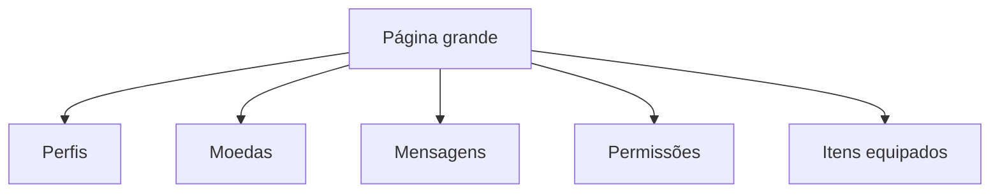
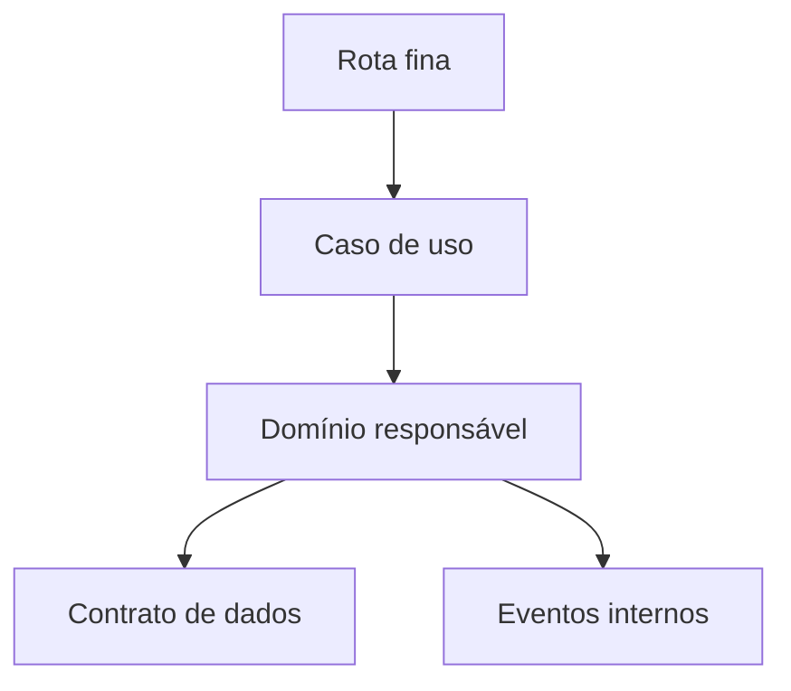
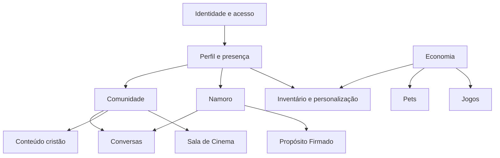
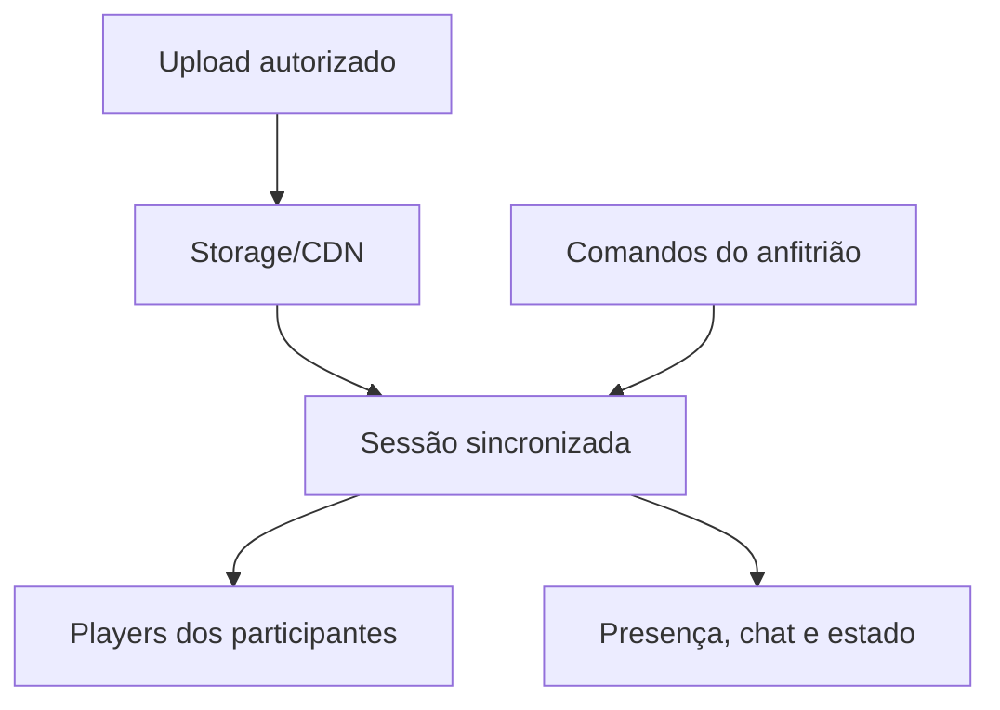

# VaiDarNamoro — Item 4: Nova Arquitetura por Domínios

**Projeto:** VaiDarNamoro / comunidade cristã  
**Repositório:** `tonyrodrigues98/vaidarnamorocristao`  
**Branch analisada:** `main`  
**Commit canônico:** `1de94bca421c36d32b1a4d96b2fc96f2330129aa`  
**Data:** 22 de julho de 2026  
**Natureza:** projeto arquitetural documental, sem alterações no código ou no Supabase

---

## 1. Conclusão executiva

O VaiDarNamoro futuro deve ser organizado como uma **plataforma comunitária cristã com experiências especializadas**, dentro da qual namoro continua sendo uma área importante, mas deixa de controlar a identidade, a descoberta e a participação social de todos os usuários.

A arquitetura recomendada é um **monólito modular orientado por domínios**, mantendo:

- React, TanStack Start e TanStack Router;
- Supabase Auth, Postgres, RLS, Realtime e Storage;
- funções server-side para operações privilegiadas;
- PWA e Web Push;
- os dados e comportamentos valiosos já existentes.

Não se recomenda dividir o produto agora em microserviços. A complexidade atual vem principalmente de fronteiras ausentes dentro do mesmo projeto, e não da incapacidade da infraestrutura de executar o produto.

O novo modelo terá 17 domínios:

1. Aquisição e entrada;
2. Identidade e acesso;
3. Perfil e presença;
4. Comunidade;
5. Namoro e descoberta romântica;
6. Conversas;
7. Propósito Firmado;
8. Conteúdo cristão;
9. Economia;
10. Inventário e personalização;
11. Pets;
12. Jogos e recompensas;
13. Sala de Cinema e mídia social;
14. Notificações;
15. Confiança, segurança e moderação;
16. Suporte e operação administrativa;
17. Métricas e dashboard.

O avatar-personagem customizável **não pertence à arquitetura futura**. Ele será tratado como domínio legado em retirada controlada. Foto de perfil, molduras, auras, fundos, gradientes e outras decorações permanecem.

---

## 2. Decisões de produto que orientam a arquitetura

### 2.1 Comunidade é a plataforma; namoro é uma experiência

O usuário poderá:

- criar uma conta;
- participar da comunidade;
- acompanhar conteúdo cristão;
- conversar em espaços permitidos;
- personalizar seu perfil;
- ter pet e acessar jogos;
- participar de eventos e da Sala de Cinema;
- optar por estar ou não disponível romanticamente.

Não estar disponível para namoro não poderá esconder o usuário da comunidade nem retirar recursos comunitários legítimos.

### 2.2 Um perfil, várias apresentações

Haverá uma identidade principal e apresentações específicas:

- perfil comunitário;
- cartão compacto usado em chats e listas;
- perfil romântico, exibido apenas quando habilitado;
- perfil do casal, quando houver Propósito Firmado;
- identidade operacional de staff, quando aplicável.

Essas apresentações usam a mesma pessoa, mas obedecem a permissões, campos e objetivos diferentes.

### 2.3 Perfil altamente customizável, configuração simples

O perfil seguirá a inspiração de personalização da Steam, sem copiar seu design:

- capa e fundo;
- foto decorada;
- identidade visual equipada;
- vitrines modulares;
- destaques escolhidos pelo usuário;
- ordem configurável de módulos;
- conquistas, presentes, pet, conteúdo e atividade selecionados;
- temas e níveis de raridade;
- pré-visualização antes de publicar.

A configuração seguirá um modelo simples, semelhante à clareza do WhatsApp:

- opções compreensíveis;
- seletores diretos;
- privacidade por categoria;
- nenhuma configuração técnica exposta;
- padrões seguros;
- desfazer e restaurar layout padrão.

### 2.4 `/inicio` e `/dashboard` continuam diferentes

- `/inicio` é o hub editorial e de ações do dia.
- `/dashboard` é o painel de métricas, evolução e atividade do usuário.

Não haverá redirecionamento automático de um para o outro.

### 2.5 Mídia pesada não cresce junto com o Git

Imagens, sprites, vídeos e arquivos enviados devem residir em Storage/CDN. O repositório guarda apenas código, pequenos assets essenciais e referências versionadas.

---

## 3. Problema arquitetural atual

O sistema atual é funcional, mas páginas e serviços atravessam muitos domínios ao mesmo tempo.

Exemplos:

- Perfil próprio mistura identidade, namoro, economia, inventário, conquistas, presentes e administração.
- Comunidade está implementada principalmente como uma conversa global.
- Pretendentes também funciona, indiretamente, como descoberta de pessoas.
- Moedas, recompensas e equipamentos são usados por loja, pets, jogos, avatar e perfil.
- Propósito Firmado altera Pretendentes, conversas, perfil e disponibilidade.
- Admin consulta e modifica quase todos os sistemas em telas monolíticas.

O problema não é apenas tamanho de arquivo. O problema central é **ausência de propriedade explícita das regras**.

### 3.1 Sintoma atual



Uma página conhece detalhes de muitas tabelas, executa regras e monta a interface. Trocar o design pode acidentalmente trocar o comportamento.

### 3.2 Estado desejado



A rota coordena a experiência, mas cada domínio continua dono de suas regras e dados.

---

## 4. Estilo arquitetural recomendado

### 4.1 Monólito modular

O produto continuará implantado como uma aplicação principal, porém dividido internamente em módulos com contratos claros.

Benefícios:

- preserva a stack atual;
- evita custo operacional prematuro de microserviços;
- mantém transações no Postgres;
- permite reutilizar RLS e Realtime;
- reduz risco da migração;
- possibilita extrair um domínio no futuro, se houver necessidade real.

### 4.2 Fatias verticais por domínio

Cada domínio deve concentrar:

- tipos e entidades;
- regras de negócio;
- casos de uso;
- consultas;
- comandos/mutações;
- componentes próprios;
- testes;
- adaptadores Supabase;
- eventos que publica e consome.

### 4.3 Camadas mínimas

Não é necessário criar burocracia excessiva. Cada domínio pode usar quatro áreas práticas:

| Área | Responsabilidade |
|---|---|
| `model` | entidades, estados, tipos e regras puras |
| `data` | queries, mutations, RPCs e adaptadores Supabase |
| `features` | casos de uso e fluxos do domínio |
| `ui` | componentes visuais pertencentes ao domínio |

### 4.4 Rotas finas

Arquivos em `src/routes` devem:

- validar acesso;
- compor layouts;
- chamar casos de uso públicos;
- lidar com parâmetros de rota;
- não conter consultas extensas nem regras econômicas.

### 4.5 Backend como autoridade

Continuam no backend:

- autorização;
- compra e gasto;
- XP e recompensas;
- sorteios e resultados de jogos;
- criação de match;
- estados de Propósito Firmado;
- moderação e sanções;
- propriedade de inventário;
- limites, cooldowns e cotas.

---

## 5. Mapa de contextos



Domínios transversais — notificações, segurança/moderação, administração e métricas — observam eventos dos demais, mas não assumem suas regras.

---

## 6. Domínio 1 — Aquisição e entrada

### Missão

Apresentar a plataforma, converter visitantes e conduzir novos membros até uma conta utilizável.

### Responsabilidades

- landing page;
- páginas institucionais;
- SEO e compartilhamento;
- instalação PWA;
- cadastro e login visual;
- onboarding progressivo;
- aceite de termos;
- explicação de comunidade e namoro.

### Nova regra

O onboarding não deve exigir que a pessoa se declare disponível para namoro. Ele cria primeiro identidade comunitária; a ativação romântica é uma decisão separada e reversível.

### Não pertence a este domínio

- aprovação operacional;
- critérios de pretendentes;
- edição completa do perfil;
- compra de itens.

### Estado

Preservar o fluxo de autenticação, redesenhar posicionamento e dividir onboarding básico de configuração romântica.

---

## 7. Domínio 2 — Identidade e acesso

### Missão

Responder quem é o usuário para o sistema e quais ações ele pode executar.

### Responsabilidades

- sessão;
- status da conta;
- cargos e capacidades;
- aceite de termos;
- aprovação, rejeição e banimento;
- exclusão e reativação;
- escopo básico de privacidade;
- guards de acesso.

### Entidades centrais atuais

- `profiles`, apenas no aspecto de vínculo com `auth.users` e estado;
- `user_roles`;
- `terms_acceptances`;
- apelações, avisos e solicitações administrativas.

### Contrato público

O restante da aplicação pergunta:

- `can(user, capability)`;
- `accountStatus(user)`;
- `isApproved(user)`;
- `primaryRole(user)`;
- `canEnter(domain)`.

Não deve reimplementar hierarquia de cargos em cada página.

### Estado

Preservar dados e comportamento; substituir verificações espalhadas por capacidades centralizadas e testáveis.

---

## 8. Domínio 3 — Perfil e presença

### Missão

Representar a identidade pública e controlável de uma pessoa na plataforma.

### Responsabilidades

- dados públicos básicos;
- foto principal e galeria;
- biografia e fé;
- presença e última atividade;
- visibilidade de campos;
- layout modular do perfil;
- vitrines e destaques;
- visualização do próprio perfil e de terceiros;
- cartões compactos reutilizáveis;
- configurações simples de perfil e privacidade.

### Submódulos propostos

| Submódulo | Função |
|---|---|
| Identidade pública | nome, foto, bio, localidade e apresentação |
| Fé e trajetória | igreja, ministério, rotina e testemunho |
| Aparência | fundo, capa, moldura, aura, gradiente e tema |
| Vitrines | módulos escolhidos e ordenados pelo usuário |
| Presença | online, última atividade e disponibilidade social |
| Privacidade | audiência por campo e por vitrine |
| Visualizações | registro e métricas de visitas conforme consentimento |

### Vitrines iniciais possíveis

- Sobre mim;
- Minha fé;
- Favoritos;
- Conquistas;
- Presentes recebidos;
- Pet em destaque;
- Devocionais ou versículos favoritos;
- Atividade comunitária selecionada;
- Galeria;
- Status de relacionamento, quando o usuário escolher exibir;
- módulos futuros aprovados pelo produto.

### Regras críticas

- itens visuais só podem ser equipados se pertencem ao usuário;
- a audiência de cada módulo deve ser respeitada no servidor/banco;
- perfil comunitário não revela automaticamente preferências românticas;
- bloquear alguém afeta a visualização conforme política central;
- staff não ganha acesso privado por causa do badge visual.

### Estado

Redesenhar profundamente. Preservar dados, fotos, decorações, presentes e conquistas. Extrair configurações, namoro, economia e admin da página atual.

---

## 9. Domínio 4 — Comunidade

### Missão

Permitir pertencimento, descoberta social e convivência cristã sem exigir disponibilidade romântica.

### Responsabilidades futuras

- feed comunitário;
- perfis e descoberta de membros;
- seguir, acompanhar ou conectar-se, conforme decisão futura;
- espaços/grupos;
- eventos;
- chat comunitário global;
- reações, comentários e compartilhamentos;
- regras de convivência;
- vínculos comunitários independentes de match.

### Estados sociais separados

| Conceito | Significado |
|---|---|
| Membro visível | pode aparecer na comunidade |
| Disponível para conversa social | aceita contato comunitário conforme privacidade |
| Seguindo/conectado | vínculo social não romântico |
| Participante de espaço | pertence a grupo ou comunidade temática |
| Disponível romanticamente | pertence exclusivamente ao domínio Namoro |

### Migração conceitual

O `global_messages` continua existindo como chat geral, mas deixa de representar sozinho toda a comunidade.

### Estado

Novo domínio principal. Preserva chat global e interações existentes; adiciona estrutura social independente.

---

## 10. Domínio 5 — Namoro e descoberta romântica

### Missão

Gerenciar disponibilidade, preferências, descoberta de pretendentes, interesse e match com consentimento.

### Responsabilidades

- ativar/desativar modo namoro;
- perfil romântico;
- preferências;
- elegibilidade;
- filtros e afinidade;
- lista de pretendentes;
- interesse unilateral;
- reciprocidade e match;
- desfazer match;
- bloqueios e denúncias relacionadas;
- efeitos de compromisso ativo.

### Nova fronteira obrigatória

O domínio recebe do Perfil apenas campos públicos autorizados. Ele não controla a existência comunitária do usuário.

### Estado de disponibilidade sugerido

- `inactive`: não participa do namoro;
- `active`: pode aparecer segundo preferências e privacidade;
- `paused`: pausa voluntária sem apagar dados;
- `committed`: indisponível por Propósito Firmado;
- `restricted`: indisponível por regra de segurança/moderação.

### Regras preservadas até revisão explícita

- aprovação necessária;
- bloqueio nos dois sentidos;
- exclusão de compromisso ativo;
- não duplicar interesse ou match;
- acesso de mensagens apenas aos participantes;
- afinidade e filtros não podem expor campos privados.

### Estado

Preservar o motor existente, redesenhar a UI e separar descoberta romântica da descoberta comunitária.

---

## 11. Domínio 6 — Conversas

### Missão

Oferecer comunicação confiável e em tempo real para diferentes contextos autorizados.

### Tipos de conversa

- conversa de match;
- conversa de Propósito Firmado;
- chat comunitário global;
- chat de grupo/espaço futuro;
- chat da Sala de Cinema;
- suporte, mantido em canal operacional separado.

### Núcleo compartilhado

- envio otimista;
- paginação reversa;
- resposta, edição e exclusão;
- entregue/lido;
- digitação;
- anexos permitidos;
- stickers;
- moderação;
- bloqueio;
- viewport e teclado mobile;
- Realtime;
- reconciliação após falha.

### Regra arquitetural

Cada contexto fornece uma política de participação. O motor de conversa não decide quem pode formar match, entrar em grupo ou acessar uma sessão de cinema.

### Estado

Preservar comportamento do chat privado. Extrair um núcleo reutilizável sem criar uma tabela universal prematuramente.

---

## 12. Domínio 7 — Propósito Firmado

### Missão

Administrar o compromisso bilateral e sua experiência exclusiva.

### Responsabilidades

- pedido, aceite, rejeição e encerramento;
- exclusividade;
- pausa do modo namoro;
- espaço do casal;
- timeline;
- cápsulas do tempo;
- galeria e conquistas do casal;
- regras de conversa durante o compromisso;
- preservação de histórico.

### Regra arquitetural

Propósito Firmado publica eventos; não altera tabelas de outros domínios silenciosamente por lógica duplicada no frontend.

Eventos principais:

- `purpose.requested`;
- `purpose.accepted`;
- `purpose.ended`;
- `purpose.visibility_changed`.

Namoro, Conversas, Perfil e Notificações reagem a esses eventos segundo regras próprias.

### Estado

Preservar integralmente e criar um orquestrador explícito antes de redesenhar regras.

---

## 13. Domínio 8 — Conteúdo cristão

### Missão

Organizar experiências espirituais e conteúdo confiável sem transformar fé em competição.

### Responsabilidades

- devocionais;
- Bíblia e referências;
- pedidos de oração;
- comentários e reações;
- quiz bíblico;
- notícias e blog;
- favoritos e progresso futuro;
- revisão e moderação de conteúdo espiritual.

### Relação com Comunidade

Conteúdo cristão publica objetos que a Comunidade pode distribuir. Comunidade cuida de alcance e interação social; Conteúdo cuida de autoria, formato, referência, publicação e integridade bíblica.

### Estado

Preservar funções atuais, unificar navegação e criar contratos de conteúdo reutilizáveis.

---

## 14. Domínio 9 — Economia

### Missão

Ser a única autoridade sobre saldo, XP, recompensas e transações.

### Responsabilidades

- moedas;
- XP e níveis;
- histórico contábil;
- recompensas diárias;
- starter bundle;
- débitos e créditos;
- idempotência;
- limites e antifraude;
- concessões administrativas auditadas.

### Invariantes

- saldo nunca é alterado diretamente pelo cliente;
- toda alteração gera transação;
- operações repetidas usam chave idempotente;
- débito e entrega ocorrem atomicamente;
- XP não aceita valor arbitrário fornecido pelo usuário;
- fonte e motivo são registrados;
- saldo exibido pode ser cacheado, saldo oficial não.

### Relação com outros domínios

Loja, Pets, Jogos, Presentes e eventos solicitam uma operação econômica. Eles não escrevem saldo.

### Estado

Preservar dados, corrigir riscos do Item 2 e unificar contratos transacionais.

---

## 15. Domínio 10 — Inventário e personalização

### Missão

Gerenciar propriedade digital, catálogo, equipamento e aparência do perfil.

### Responsabilidades

- loja;
- inventários;
- molduras;
- auras;
- fundos;
- capas;
- gradientes;
- stickers;
- badges;
- presentes;
- temas e módulos cosméticos futuros;
- equipamento e desequipamento;
- raridade e disponibilidade.

### Separação da Economia

Economia confirma pagamento. Inventário confirma entrega e propriedade. Perfil apenas renderiza a seleção autorizada.

### Modelo de item futuro

Todo item deve declarar:

- identificador estável;
- tipo;
- versão;
- raridade;
- preço ou origem;
- asset remoto;
- compatibilidade;
- estado ativo;
- metadados de renderização;
- política de transferência ou não transferência.

### Avatar-personagem

As sete tabelas e assets do avatar-personagem permanecem como legado até o protocolo de retirada. Não recebem novas features.

### Estado

Preservar personalização de perfil e presentes; unificar padrões de catálogo/inventário; remover futuramente apenas o personagem customizável.

---

## 16. Domínio 11 — Pets

### Missão

Operar o pet como subproduto completo, sem espalhar sua complexidade pelo núcleo social.

### Subdomínios

- catálogo e adoção;
- instância do pet;
- cuidado e necessidades;
- personalidade;
- progressão e evolução;
- benefícios e buffs;
- missões;
- expedições;
- cenários;
- álbum;
- renascimento/prestígio;
- eventos e confissões.

### Fronteira

Perfil pode exibir um resumo do pet. Economia pode financiar ações. Notificações pode avisar eventos. Nenhum deles manipula internamente `user_pets_v2`, cuidado ou progressão.

### Dívida obrigatória

`user_pets` e `user_pets_v2` devem permanecer compatíveis até que consumidores e dados reais sejam medidos.

### Estado

Preservar como módulo isolável, refatorar internamente e otimizar assets.

---

## 17. Domínio 12 — Jogos e recompensas

### Missão

Gerenciar Pet Arcade, caixas, Grab e experiências lúdicas com resultado confiável.

### Responsabilidades

- catálogo de jogos;
- sessões/rodadas;
- entrada e custo;
- resultado autoritativo;
- missões diárias;
- limites;
- pity/cooldown;
- prêmios;
- telemetria de jogo;
- integração com Economia e Inventário.

### Regra

O cliente apresenta animação e interação. O backend determina e registra resultado, elegibilidade e recompensa.

### Classificação futura

Cada jogo será avaliado individualmente:

- preservar;
- refazer experiência;
- substituir;
- arquivar.

### Estado

Preservar infraestrutura segura, refatorar jogos em módulos e não carregar todos os assets no bundle inicial.

---

## 18. Domínio 13 — Sala de Cinema e mídia social

### Missão

Criar sessões comunitárias de vídeo sincronizado com chat e presença social.

### Responsabilidades futuras

- catálogo de vídeos autorizados;
- upload e processamento;
- sessões agendadas ou imediatas;
- anfitrião e moderadores;
- estado sincronizado do player;
- participantes e presença;
- chat da sessão;
- reações rápidas;
- convites;
- histórico e encerramento;
- moderação e denúncias.

### Modelo técnico



### Regras

- o vídeo não é compartilhamento de tela;
- participantes carregam o mesmo arquivo otimizado;
- play, pause, seek e posição são sincronizados;
- somente papéis autorizados controlam a sessão;
- reconexão corrige desvio de tempo;
- upload exige política de direitos e retenção;
- vídeo nunca entra no repositório Git.

### Estado

Domínio novo. Deve ser criado depois das fronteiras de Comunidade, Conversas, Mídia e Moderação.

---

## 19. Domínio 14 — Notificações

### Missão

Entregar eventos relevantes no aplicativo e por push com segurança.

### Responsabilidades

- inbox de notificações;
- preferências por categoria;
- fila de push;
- inscrições por dispositivo;
- deep links;
- agrupamento e deduplicação;
- quiet hours futuras;
- entrega, falha e repetição;
- compatibilidade PWA.

### Regra

Outros domínios publicam eventos; Notificações decide canal, formato e momento. Nenhum domínio deve disparar `service_role` diretamente do navegador.

### Estado

Preservar, corrigir o endpoint público e introduzir contratos tipados de evento.

---

## 20. Domínio 15 — Confiança, segurança e moderação

### Missão

Proteger pessoas, conteúdo, identidade, economia e operação.

### Responsabilidades

- bloqueios;
- denúncias;
- palavras restritas;
- moderação de fotos;
- verificação;
- sanções;
- apelações;
- rate limits;
- antifraude;
- trilha de auditoria;
- políticas de mídia;
- revisão humana.

### Fronteira

Este domínio define decisões e capacidades de segurança. As interfaces de cada domínio exibem o efeito apropriado sem duplicar critérios.

### Estado

Prioridade P0/P1 conforme Item 2. Deve anteceder grandes expansões comunitárias.

---

## 21. Domínio 16 — Suporte e operação administrativa

### Missão

Permitir atendimento e operação do produto com autoridade mínima necessária.

### Subaplicações administrativas

- usuários e acesso;
- moderação;
- comunidade e conteúdo;
- namoro e relacionamentos;
- economia e inventário;
- pets;
- jogos;
- cinema e mídia;
- notificações;
- suporte;
- configurações;
- auditoria e saúde do sistema.

### Regra

Admin não é um superdomínio dono de tudo. Ele usa casos de uso administrativos publicados por cada domínio.

### Capacidades

Permissão deve ser por ação, por exemplo:

- `users.review`;
- `economy.grant_with_audit`;
- `content.publish`;
- `pets.catalog_manage`;
- `cinema.session_moderate`.

### Estado

Preservar capacidades, dividir telas gigantes e substituir checagens amplas por capabilities.

---

## 22. Domínio 17 — Métricas e dashboard

### Missão

Oferecer métricas pessoais e operacionais sem obrigar páginas a fazer agregações frágeis no cliente.

### Responsabilidades

- `/dashboard` do usuário;
- visitas, interesses, matches e atividade;
- métricas comunitárias autorizadas;
- métricas de produto para staff;
- agregações e snapshots;
- definições consistentes de indicadores.

### Regra

Métricas consomem dados/eventos dos domínios e não alteram suas regras. Dados sensíveis devem ser minimizados e agregados.

### Estado

Preservar `/dashboard`, formalizar definições e mover agregações críticas para views/RPCs seguras.

---

## 23. Domínios transversais de plataforma

Estes não são features visíveis isoladas:

| Núcleo | Responsabilidade |
|---|---|
| Design system | tokens, tipografia Poppins, componentes base, acessibilidade e motion |
| PWA/runtime | Service Worker, instalação, offline, atualização e safe areas |
| Mídia | upload, transformação, formatos, CDN, retenção e URLs assinadas |
| Observabilidade | logs, erros, métricas técnicas, tracing e alertas |
| Configuração | feature flags, limites e parâmetros por ambiente |
| Eventos internos | envelopes, nomes, versão e entrega de eventos |
| Testes | fixtures, usuários por cargo, contratos e integração Supabase |

O diretório `shared` deve conter apenas infraestrutura genuinamente transversal. Regras de namoro, pet, economia ou perfil não entram em `shared`.

---

## 24. Matriz de propriedade de dados

| Dado/regra | Dono | Consumidores principais |
|---|---|---|
| Sessão e capacidades | Identidade e acesso | todos |
| Foto, bio e visibilidade | Perfil | comunidade, namoro, chat |
| Disponibilidade romântica | Namoro | perfil, propósito, notificações |
| Interesse e match | Namoro | conversas, propósito, métricas |
| Mensagens | Conversas | namoro, comunidade, cinema |
| Compromisso | Propósito Firmado | namoro, perfil, conversas |
| Post/devocional/oração | Conteúdo cristão | comunidade, notificações |
| Saldo e XP | Economia | loja, pets, jogos, admin |
| Propriedade de item | Inventário | perfil, chat, comunidade |
| Estado do pet | Pets | perfil, notificações, jogos |
| Rodada e resultado | Jogos | economia, inventário, métricas |
| Sessão e playback | Cinema | comunidade, conversas, notificações |
| Denúncia/sanção | Segurança | todos os domínios interativos |

Regra: consumidor lê por contrato público, view ou caso de uso; não assume propriedade da tabela.

---

## 25. Eventos internos recomendados

Eventos não substituem transações. Eles propagam fatos já confirmados.

| Evento | Publicado por | Consumido por |
|---|---|---|
| `account.approved` | Identidade | onboarding, notificações |
| `profile.updated` | Perfil | comunidade, namoro, cache |
| `dating.activated` | Namoro | perfil, métricas |
| `match.created` | Namoro | conversas, notificações |
| `purpose.accepted` | Propósito | namoro, perfil, conversas |
| `coin.transaction_posted` | Economia | dashboard, notificações |
| `inventory.item_acquired` | Inventário | perfil, notificações |
| `pet.need_changed` | Pets | notificações |
| `game.round_settled` | Jogos | economia, inventário, métricas |
| `cinema.session_started` | Cinema | comunidade, notificações |
| `moderation.action_applied` | Segurança | identidade e domínio afetado |

Todo evento deve ter:

- `event_id`;
- nome e versão;
- data/hora;
- ator quando permitido;
- recurso afetado;
- payload mínimo;
- chave de correlação;
- classificação de privacidade.

---

## 26. Estrutura de código-alvo

Estrutura conceitual, não uma ordem de mudança imediata:

```text
src/
  app/
    providers/
    routing/
    shell/
  domains/
    identity/
    profile/
    community/
    dating/
    conversations/
    purpose/
    faith-content/
    economy/
    inventory/
    pets/
    games/
    cinema/
    notifications/
    trust-safety/
    support/
    admin/
    analytics/
  shared/
    design-system/
    media/
    pwa/
    observability/
    config/
    testing/
  routes/
```

Exemplo interno:

```text
domains/profile/
  model/
  data/
  features/
  ui/
  contracts/
  tests/
  index.ts
```

O `index.ts` do domínio expõe apenas sua API pública. Importações internas profundas de outro domínio devem ser proibidas por lint.

---

## 27. Regras de dependência

1. Rotas podem compor APIs públicas de vários domínios.
2. Um domínio não importa arquivos internos de outro domínio.
3. `shared` não importa domínios.
4. UI não escreve diretamente em tabelas críticas.
5. Economia, jogos e inventário usam RPCs transacionais.
6. Admin usa comandos administrativos explícitos e auditados.
7. Tipos de banco gerados não substituem tipos de domínio.
8. Eventos carregam o mínimo de dados necessário.
9. RLS continua obrigatória mesmo com guards no frontend.
10. Feature flags controlam migração gradual, não segurança.

---

## 28. Mapeamento das áreas atuais

| Área atual | Domínio futuro | Destino |
|---|---|---|
| Landing/institucional | Aquisição | reposicionar |
| Onboarding | Aquisição + Identidade + Perfil | dividir |
| `/inicio` | composição comunitária | preservar e redesenhar |
| `/dashboard` | Métricas | preservar separado |
| `/perfil` | Perfil + vitrines | reconstruir gradualmente |
| `/pretendentes` | Namoro | preservar motor |
| Interesses/matches | Namoro | preservar |
| Chat privado | Conversas | preservar comportamento |
| Comunidade global | Comunidade + Conversas | expandir |
| Propósito Firmado | domínio próprio | preservar integralmente |
| Recados anônimos | Namoro/experiência autônoma | decidir no Item 5 |
| Devocional/orações/Bíblia | Conteúdo cristão | unificar experiência |
| Loja/presentes | Inventário + Economia | modularizar |
| Avatar-personagem | legado | retirar com protocolo |
| Molduras/auras/fundos | Inventário + Perfil | preservar |
| Meu Pet | Pets | modularizar |
| Pet Arcade/Grab | Jogos | avaliar por jogo |
| Notificações | Notificações | endurecer segurança |
| Suporte | Suporte | preservar |
| Admin | operação por domínio | dividir |
| Sala de Cinema | Cinema | criar |

---

## 29. Estratégia para banco e Supabase

### Curto prazo

- manter schema `public` e tabelas atuais;
- criar ownership documental;
- encapsular acessos em repositórios/casos de uso;
- corrigir grants, RLS e RPCs críticas;
- confirmar snapshot publicado do Item 3.

### Médio prazo

- criar views/RPCs públicas por domínio;
- padronizar nomes de comandos e consultas;
- adicionar event outbox quando necessário;
- reduzir consultas cruzadas no cliente;
- regenerar tipos e eliminar `as any`/`as never` gradualmente.

### Longo prazo

Schemas Postgres separados podem ser avaliados somente se Supabase, PostgREST e RLS continuarem simples e testáveis. Não são pré-requisito para modularização.

---

## 30. Estratégia de mídia e crescimento

### No repositório

- logos e ícones essenciais;
- pequenos placeholders;
- fontes apenas se licenciadas e necessárias;
- manifestos e metadados;
- nenhum vídeo de usuário;
- nenhum catálogo massivo de sprites.

### Em Storage/CDN

- fotos de perfil;
- fundos e capas;
- pets e animações;
- assets de jogos;
- vídeos da Sala de Cinema;
- anexos de conteúdo;
- versões responsivas e thumbnails.

### Contrato de asset

Cada asset deve ter:

- owner/domínio;
- bucket e caminho estáveis;
- tipo MIME permitido;
- limite de tamanho;
- checksum;
- versões derivadas;
- política de acesso;
- retenção;
- status de moderação;
- referência no banco.

Essa divisão permite o produto chegar a muitos gigabytes de mídia sem transformar o Git em armazenamento de conteúdo.

---

## 31. Estratégia de cache e carregamento

- carregar apenas o domínio da rota atual;
- lazy-load de jogos, pets, admin e cinema;
- manifests pequenos para catálogos grandes;
- imagens responsivas e formatos modernos;
- prefetch apenas de rotas prováveis;
- TanStack Query como padrão de cache de servidor;
- cache local separado de estado de interface;
- invalidação por chave de domínio e eventos;
- Service Worker sem guardar dados privados indiscriminadamente;
- assets pesados versionados por URL/hash.

---

## 32. Contratos de preservação

Durante a futura migração:

- não recriar autenticação do zero;
- não perder status, cargos ou aceites;
- não misturar comunidade e elegibilidade romântica;
- não apagar interesses, matches ou mensagens;
- não alterar Propósito Firmado sem testes bilaterais;
- não reescrever saldo, XP ou inventários no cliente;
- não confundir avatar-personagem com foto/decorations;
- não eliminar `user_pets` ou `user_pets_v2` diretamente;
- não substituir chat maduro por protótipo visual;
- não remover `/dashboard`;
- não colocar mídia pesada no repositório;
- não reduzir RLS para facilitar novas telas.

---

## 33. Decisões que ficam para o Item 5

O Item 4 define fronteiras. O Item 5 deverá decidir detalhadamente a separação entre comunidade e namoro, incluindo:

- tipos de vínculo social;
- quem pode encontrar quem na comunidade;
- quem pode iniciar conversa social;
- privacidade e consentimento;
- ativação do modo namoro;
- campos comunitários versus românticos;
- impacto de bloqueio;
- comportamento de pessoas comprometidas;
- staff e presença pública;
- destino dos recados anônimos;
- navegação principal e entrada de cada experiência.

---

## 34. Ordem futura de implementação

Esta não é autorização para implementar; é a sequência recomendada quando a fase documental terminar.

1. corrigir riscos P0 do Item 2;
2. confirmar o snapshot publicado do Item 3;
3. criar capacidades centralizadas de Identidade;
4. estabelecer estrutura de módulos e regras de importação;
5. separar perfil comunitário de configuração romântica;
6. encapsular Economia e Inventário;
7. extrair o núcleo de Conversas sem alterar UX;
8. criar Comunidade como domínio independente;
9. redesenhar Perfil com vitrines e feature flag;
10. modularizar Admin;
11. modularizar Pets e Jogos;
12. retirar avatar-personagem com compensação definida;
13. criar Sala de Cinema sobre os novos contratos;
14. otimizar mídia, cache e bundles continuamente.

---

## 35. Critérios de aceitação do Item 4

Este item está documentalmente concluído quando:

- cada grande capacidade tem um domínio dono;
- comunidade não depende da disponibilidade romântica;
- namoro continua preservado e importante;
- perfil modular possui fronteira própria;
- economia e inventário estão separados;
- pets e jogos são isoláveis;
- Sala de Cinema tem posição arquitetural definida;
- avatar-personagem está marcado como legado em retirada;
- foto, molduras, auras, fundos e gradientes estão protegidos;
- `/inicio` e `/dashboard` permanecem distintos;
- mídia pesada está fora do Git;
- regras de dependência e migração estão registradas;
- nenhuma mudança foi aplicada ao sistema.

---

## 36. Limitações e pendências

Este documento é um desenho-alvo, não prova do banco publicado. Permanecem pendentes:

- executar o inventário read-only do Item 3 no Supabase real;
- revisar com o proprietário o destino de cada feature no Item 1;
- definir o modelo social exato no Item 5;
- validar designs produzidos no Sites como referência, não como código canônico;
- decidir compensação para itens do avatar-personagem;
- escolher quais jogos permanecem;
- definir política jurídica e operacional para vídeos da Sala de Cinema;
- produzir contratos técnicos detalhados na fase de implementação.

---

## 37. Registro de integridade

Para produzir este Item 4:

- o GitHub foi consultado somente em leitura;
- `main` foi confirmado em `1de94bca421c36d32b1a4d96b2fc96f2330129aa`;
- os Itens 1, 2 e 3 foram usados como base documental;
- nenhum arquivo do repositório foi editado;
- nenhum commit ou branch foi criado;
- nenhuma migration foi executada;
- nenhuma tabela, policy, RPC, bucket ou dado foi alterado;
- o documento descreve arquitetura futura, não comportamento já implantado.

**Resultado:** arquitetura por domínios definida e pronta para orientar o Item 5 e a revisão futura do Item 1.
