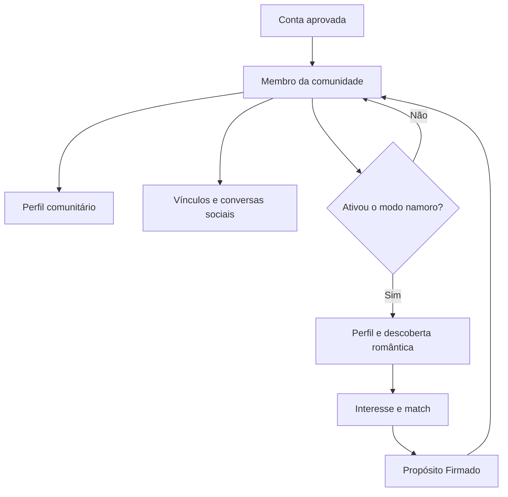

# VaiDarNamoro — Item 5: Separação entre Comunidade e Namoro

**Projeto:** VaiDarNamoro / comunidade cristã  
**Tipo:** especificação funcional e arquitetural, sem implementação  
**Data do retrato:** 22 de julho de 2026  
**GitHub:** `tonyrodrigues98/vaidarnamorocristao`  
**Branch:** `main`  
**Commit de referência:** `1de94bca421c36d32b1a4d96b2fc96f2330129aa`  
**Base documental:** Itens 1, 2, 3 e 4  
**Estado do projeto:** nenhuma alteração aplicada

---

## 1. Objetivo deste item

Este documento define como o VaiDarNamoro deixa de exigir disponibilidade romântica para participação social.

A plataforma futura será uma **comunidade cristã completa**, com namoro como uma experiência importante, opcional, reversível e separada.

O Item 5 decide:

- quem pode participar da comunidade;
- quem pode encontrar quem;
- quais vínculos sociais existirão;
- quem pode iniciar conversas sociais;
- como funciona o consentimento;
- como alguém ativa, pausa e encerra o modo namoro;
- quais dados pertencem ao perfil comunitário;
- quais dados pertencem ao perfil romântico;
- como bloqueios afetam todos os contextos;
- como o Propósito Firmado se comporta sem retirar a pessoa da comunidade;
- como staff aparece na plataforma;
- qual será o destino dos recados anônimos;
- como a navegação apresenta comunidade e namoro sem confundir os dois;
- como migrar usuários e dados existentes sem perda.

Este não é um redesign visual e não implementa telas. Ele é o contrato funcional que o futuro redesign deverá respeitar.

---

## 2. Decisão central de produto

> Toda pessoa aprovada é, primeiro, membro da comunidade. Participar do namoro exige uma ativação separada e consentida.

Consequências:

1. ninguém precisa se declarar “disponível” para entrar na plataforma;
2. comunidade não filtra pessoas pelo sexo nem pelo estado romântico;
3. perfil comunitário existe mesmo quando o modo namoro está desligado;
4. dados românticos não aparecem automaticamente no perfil comunitário;
5. conversas sociais não dependem de match;
6. interesse romântico e match continuam existindo apenas no domínio Namoro;
7. Propósito Firmado pausa o modo namoro, mas não a vida comunitária;
8. bloqueio continua sendo uma proteção transversal;
9. recado anônimo não será um canal comunitário aberto;
10. configurações devem ser simples, com linguagem direta e poucos controles principais.

---

## 3. Estado atual confirmado no código

### 3.1 Descoberta atual é essencialmente romântica

Em `/pretendentes`, o sistema atual:

- exige `profiles.status = approved`;
- usa o sexo do visitante para selecionar o sexo oposto;
- remove bloqueios nos dois sentidos;
- remove staff oculto;
- remove usuários com compromisso ativo;
- impede o próprio usuário comprometido de carregar a lista;
- usa preferências e perfil avançado para afinidade;
- apresenta perfil individual com ações românticas.

Não existe hoje um diretório social independente.

### 3.2 Ações de perfil dependem do sexo

`pretendentesEligibility.ts` oculta ações primárias quando visitante e perfil possuem o mesmo sexo. Essa regra mistura:

- visualização social;
- presente;
- recado anônimo;
- interesse romântico;
- acesso a ações do perfil.

No futuro, a visualização comunitária não dependerá dessa regra. Apenas ações estritamente românticas usarão a elegibilidade romântica.

### 3.3 Propósito Firmado pausa mais do que o namoro

Hoje, quando há compromisso ativo:

- `/pretendentes` retorna lista vazia;
- `/interesses` retorna interesses vazios;
- `/matches` retorna matches vazios;
- `useConversationsList` retorna conversas normais vazias;
- `/recados` mostra estado de pausa;
- a interface concentra o usuário na conversa do compromisso.

Essa regra protege a exclusividade, mas foi implementada em vários consumidores. No produto futuro, ela será centralizada e pausará somente superfícies românticas.

### 3.4 Comunidade atual é uma conversa global

`/conversas/comunidade`:

- exige membro aprovado;
- usa `community_messages`;
- possui Realtime;
- suporta cargos, badges e moderação;
- consulta perfis e decorações;
- convive com informações de compromisso.

Ela é uma boa experiência de chat, porém ainda não representa um domínio social completo.

### 3.5 Bloqueio atual é global na intenção, mas distribuído na aplicação

A tabela `blocks` registra `blocker_id` e `blocked_id`.

A interface informa que bloqueados deixam de aparecer em:

- pretendentes;
- matches;
- conversas.

Há consultas diferentes em cada página. A futura política precisa ser única, bilateral na visibilidade e aplicada também a feed, grupos, eventos, cinema e solicitações sociais.

### 3.6 Recados anônimos são um subsistema maduro

O sistema atual possui:

- opção de aceitar ou não recados;
- caixa de entrada e saída;
- cotas e extras;
- cooldown;
- dicas;
- resposta;
- pedido de revelação;
- revelação mútua;
- expiração;
- denúncia;
- vínculo posterior com match/conversa;
- pausa durante compromisso ativo.

Ele deve ser preservado como dado e comportamento até a futura migração, mas reposicionado exclusivamente dentro do namoro.

---

## 4. Vocabulário canônico

Para evitar novas ambiguidades, o produto usará estas definições:

| Termo | Definição |
|---|---|
| Conta | Identidade de autenticação e segurança |
| Membro | Pessoa aprovada para participar da comunidade |
| Perfil comunitário | Identidade social visível dentro da comunidade |
| Perfil romântico | Conjunto separado de informações e preferências de namoro |
| Modo namoro | Estado que permite aparecer e agir no domínio romântico |
| Seguir | Vínculo social unilateral de interesse em conteúdo |
| Conexão | Vínculo social bilateral aceito |
| Solicitação de conversa | Pedido consentido para iniciar conversa social privada |
| Interesse | Ação romântica privada e unilateral |
| Match | Interesse romântico recíproco |
| Propósito Firmado | Compromisso bilateral exclusivo construído sobre um match |
| Conversa social | Conversa que não depende de match |
| Conversa romântica | Conversa criada por match |
| Bloqueio | Proteção global entre duas contas |
| Silenciar | Preferência local para não receber atualizações sem bloquear |
| Restringir | Medida de moderação ou segurança com alcance definido |
| Disponibilidade romântica | Capacidade efetiva de aparecer e agir no namoro |

Não usar “match” como sinônimo de amizade, conexão, seguidor ou conversa social.

---

## 5. Modelo conceitual

O retorno de `Propósito Firmado` para `Comunidade` representa que o compromisso não retira o casal da plataforma social.

---

## 6. Estados independentes do usuário

Um único campo `profiles.status` não deve representar tudo.

### 6.1 Estado da conta

Responsável por autenticação e segurança:

| Estado | Significado |
|---|---|
| `active` | conta utilizável |
| `restricted` | limitações de segurança ou moderação |
| `suspended` | acesso temporariamente suspenso |
| `banned` | acesso encerrado |
| `deleted` | processo de exclusão concluído ou anonimizado |

### 6.2 Estado comunitário

| Estado | Significado |
|---|---|
| `draft` | perfil básico ainda incompleto |
| `pending_review` | aguardando aprovação |
| `active` | pode participar da comunidade |
| `limited` | participa com capacidades reduzidas |
| `hidden_by_user` | perfil não aparece no diretório, mas conta continua ativa |
| `suspended` | participação comunitária suspensa |

### 6.3 Estado configurado do namoro

| Estado | Significado |
|---|---|
| `never_configured` | nunca criou perfil romântico |
| `draft` | configuração romântica incompleta |
| `pending_review` | mudanças aguardam validação, se necessária |
| `enabled` | modo namoro ativado pelo usuário |
| `paused_by_user` | usuário pausou voluntariamente |
| `paused_by_commitment` | pausa automática por Propósito Firmado |
| `paused_by_moderation` | pausa determinada pela moderação |
| `disabled` | usuário encerrou a participação romântica |

### 6.4 Disponibilidade romântica efetiva

`dating_effective_availability` não deve ser um booleano gravado e alterado por muitas telas. Deve ser derivado.

Uma pessoa está efetivamente disponível apenas quando:

- conta está ativa;
- estado comunitário permite presença;
- perfil romântico está completo e aprovado;
- modo namoro está `enabled`;
- não existe Propósito Firmado ativo;
- não existe pausa de moderação;
- idade e regras de elegibilidade são atendidas;
- a pessoa não bloqueou nem foi bloqueada pelo candidato;
- o candidato também está efetivamente disponível;
- as preferências românticas bilaterais são compatíveis com as regras atuais do produto.

### 6.5 Regra de precedência

Quando estados conflitarem, prevalece a restrição mais forte:

1. banimento/suspensão de conta;
2. restrição comunitária;
3. pausa de moderação do namoro;
4. Propósito Firmado;
5. pausa voluntária;
6. ativação normal.

---

## 7. Entrada e onboarding

### 7.1 Princípio

O cadastro cria primeiro um membro da comunidade. O namoro é oferecido depois, como escolha clara.

### 7.2 Onboarding comunitário obrigatório

Deve pedir apenas o necessário para identidade, segurança e convivência:

- nome;
- data de nascimento;
- foto principal;
- cidade e estado;
- breve apresentação;
- fé/igreja, conforme política do produto;
- aceite dos termos e regras da comunidade;
- configurações iniciais de privacidade.

O sexo pode continuar sendo coletado como dado de identidade e para compatibilidade com o sistema existente, mas não determina quem aparece na comunidade.

### 7.3 Convite posterior para namoro

Depois da aprovação, o produto pode perguntar:

> Você quer usar também a área de namoro?

Opções simples:

- `Quero conhecer alguém`;
- `Agora não`.

“Agora não” não reduz nenhuma capacidade comunitária.

### 7.4 Configuração romântica separada

Ao ativar o namoro, pedir:

- disponibilidade atual;
- intenção de relacionamento;
- estado civil aplicável;
- preferências de idade e localização;
- questões sobre filhos e casamento;
- informações de rotina, valores e compatibilidade;
- fotos ou campos adicionais exigidos pelo domínio;
- consentimento para aparecer em Pretendentes;
- consentimento separado para receber recados anônimos.

### 7.5 Retorno e edição

O usuário pode:

- ativar;
- pausar;
- reativar;
- editar;
- desativar o modo namoro.

Pausar ou desativar não apaga histórico, matches, mensagens ou dados financeiros.

---

## 8. Perfil comunitário versus perfil romântico

### 8.1 Camada de identidade compartilhada

Usada por ambos os contextos:

| Campo | Uso comunitário | Uso romântico |
|---|---:|---:|
| nome | sim | sim |
| foto principal | sim | sim |
| idade/faixa etária | conforme privacidade | sim |
| cidade/estado | conforme privacidade | sim |
| verificação | sim | sim |
| cargo/badge | sim | sim |
| moldura, aura e fundo | sim | sim |
| status de conta | autorização | autorização |

### 8.2 Campos comunitários

| Campo ou módulo | Observação |
|---|---|
| apresentação social | não deve pressupor busca romântica |
| igreja e trajetória de fé | visibilidade configurável |
| testemunho | visibilidade configurável |
| versículo favorito | comunitário |
| ministério e participação | comunitário |
| interesses e hobbies | comunitário |
| grupos/espaços | comunitário |
| publicações, comentários e reações | comunitário |
| pedidos de oração | com privacidade própria |
| eventos e Sala de Cinema | comunitário |
| vitrines personalizáveis | comunitário |
| pet em destaque | comunitário, opcional |
| badges e conquistas | comunitário, configurável |

### 8.3 Campos românticos

| Campo | Regra |
|---|---|
| disponibilidade | nunca exposta fora do contexto apropriado |
| preferências de parceiro | não aparece no perfil comunitário |
| faixa de idade desejada | privada para o motor de elegibilidade |
| alcance de localização | privado ou resumido |
| intenção de casamento | perfil romântico |
| filhos e aceitação de filhos | perfil romântico |
| qualidades desejadas | perfil romântico |
| linguagem do amor | perfil romântico, opcional |
| ritmo de relacionamento | perfil romântico |
| não negociáveis | perfil romântico, exposição cuidadosa |
| afinidade calculada | visível apenas no namoro |
| interesses recebidos/enviados | privado |
| matches | privado |
| Propósito Firmado | visibilidade definida pelo casal |

### 8.4 Renderização contextual

Uma mesma pessoa terá uma identidade, mas duas apresentações:

- `/membros/$id`: perfil comunitário;
- `/pretendentes/$id`: perfil romântico, somente quando elegível.

O perfil comunitário não deve exibir botões como “Demonstrar interesse” para todo visitante. Quando apropriado, pode oferecer uma entrada discreta para a área romântica, respeitando consentimento e elegibilidade.

### 8.5 Personalização estilo Steam

A customização visual pertence ao perfil comunitário principal:

- capa/fundo;
- moldura;
- aura;
- gradiente de nome;
- vitrines reorganizáveis;
- badges;
- presentes;
- pet em destaque;
- módulos comunitários;
- módulo romântico opcional e privado por contexto.

A loja fornece os itens. O perfil decide como renderizá-los. O namoro não controla a personalização visual.

---

## 9. Descoberta comunitária

### 9.1 Quem aparece

Por padrão, um membro pode descobrir outros membros quando:

- ambos possuem estado comunitário compatível;
- o perfil não está oculto pelo próprio usuário;
- não há bloqueio em nenhum sentido;
- políticas de segurança não impedem a exposição;
- o contexto solicitado respeita a privacidade do perfil.

Não entram como filtros obrigatórios:

- sexo;
- disponibilidade romântica;
- existência de match;
- estado civil;
- Propósito Firmado;
- preferência romântica;
- presença ou ausência de perfil de namoro.

### 9.2 Formas de descoberta

- busca por nome;
- cidade/estado, quando permitido;
- igreja ou denominação, quando permitido;
- interesses e hobbies;
- ministérios;
- grupos e espaços em comum;
- eventos;
- conteúdo publicado;
- recomendações de comunidade;
- amigos/conexões em comum, futuramente.

### 9.3 Ranking comunitário

Não reutilizar o ranking de afinidade romântica.

O ranking comunitário pode considerar:

- interesses em comum;
- grupos em comum;
- proximidade opcional;
- atividade recente saudável;
- conteúdo relevante;
- diversidade de descoberta;
- preferências explícitas do membro.

Não deve premiar comportamento de spam, número bruto de mensagens ou exposição compulsiva.

### 9.4 Perfis comprometidos

Pessoas com Propósito Firmado continuam aparecendo normalmente na comunidade. O compromisso não as transforma em invisíveis socialmente.

Se o casal optar por exibir o compromisso, o perfil pode mostrar um badge ou módulo de casal. A ausência desse badge não significa disponibilidade romântica.

---

## 10. Descoberta romântica

### 10.1 Requisitos bilaterais

Uma pessoa só aparece para outra em `/pretendentes` quando:

- ambas têm modo namoro efetivamente disponível;
- ambas atendem às regras atuais de elegibilidade do produto;
- preferências obrigatórias são compatíveis;
- não há bloqueio em nenhum sentido;
- nenhuma está em Propósito Firmado;
- moderação não restringiu a interação;
- visibilidade de staff permite presença romântica;
- o perfil romântico está completo e aprovado.

### 10.2 Regra atual de sexo

O sistema atual trabalha com descoberta entre `masculino` e `feminino` em sentidos opostos.

Este Item 5 não altera silenciosamente essa política de produto. A mudança aqui é:

- comunidade deixa de usar sexo como filtro;
- namoro continua usando a política atual até decisão explícita do proprietário;
- a regra sai das telas e passa para uma capacidade central de elegibilidade.

### 10.3 Ações românticas

Somente o contexto romântico oferece:

- demonstrar interesse;
- cancelar interesse;
- retribuir interesse;
- acessar match;
- iniciar conversa de match;
- enviar recado anônimo;
- solicitar Propósito Firmado.

Presentes podem existir nos dois contextos, mas o significado precisa ser identificado como social ou romântico quando necessário.

### 10.4 Pausa voluntária

Ao pausar o namoro:

- deixa de aparecer em Pretendentes imediatamente;
- não recebe novos interesses;
- não pode enviar novos interesses;
- não recebe novos recados anônimos;
- matches e mensagens existentes não são apagados;
- o usuário escolhe se mantém conversas românticas existentes ativas ou apenas arquivadas, conforme política final;
- o perfil comunitário continua normal.

Recomendação: ao pausar voluntariamente, manter matches existentes acessíveis, mas exibir claramente que o perfil não está buscando novas pessoas.

### 10.5 Desativação

Desativar o namoro:

- remove o perfil da descoberta romântica;
- cancela interesses pendentes futuros conforme regra de migração;
- impede novos recados;
- preserva histórico pelo período legal e operacional aplicável;
- não apaga conta nem perfil comunitário;
- pode exigir confirmação para reativação.

---

## 11. Vínculos sociais

### 11.1 Modelo recomendado

Para manter a simplicidade, adotar apenas dois vínculos principais:

| Vínculo | Direção | Consentimento | Efeito |
|---|---|---|---|
| Seguir | unilateral | não exige aceite, salvo perfil privado | organiza conteúdo e atualizações |
| Conexão | bilateral | exige aceite | permite proximidade e conversa conforme privacidade |

Não criar “amizade”, “contato”, “parceiro”, “favorito” e “conexão” como cinco sistemas equivalentes.

### 11.2 Seguir

- seguir não significa interesse romântico;
- não cria match;
- não concede acesso a dados românticos;
- pode ser removido pelo seguido;
- perfis privados podem exigir aprovação;
- bloqueio remove e impede o vínculo.

### 11.3 Conexão

- solicitação explícita;
- aceite ou recusa;
- pode ser desfeita sem bloquear;
- pode liberar conversa social direta;
- não altera disponibilidade romântica;
- duas pessoas podem ser conexão e também ter match, mas os vínculos continuam distintos.

### 11.4 Estados da conexão

| Estado | Significado |
|---|---|
| `pending` | aguardando destinatário |
| `accepted` | conexão bilateral ativa |
| `declined` | recusada, sem exposição pública |
| `cancelled` | remetente cancelou |
| `removed` | conexão foi desfeita |
| `blocked` | encerrada por bloqueio global |

### 11.5 Controles antispam

- limite de solicitações por período;
- cooldown após recusas repetidas;
- impedir nova solicitação imediata após remoção;
- reputação e moderação para comportamento abusivo;
- nenhuma recompensa por volume bruto de conexões;
- destinatário pode limitar solicitações.

---

## 12. Conversas sociais e românticas

### 12.1 Tipos separados

| Tipo | Origem | Participação |
|---|---|---|
| Social direta | conexão ou solicitação aceita | membros autorizados |
| Romântica | match | participantes do match |
| Propósito | compromisso ativo | casal |
| Grupo/espaço | comunidade | membros do grupo |
| Comunidade global | comunidade | membros aprovados |
| Cinema | sessão | participantes autorizados |

### 12.2 Início de conversa social

Configuração recomendada, simples:

**Quem pode me enviar mensagem?**

- somente minhas conexões;
- membros da comunidade por solicitação;
- ninguém.

Padrão recomendado: `membros da comunidade por solicitação`.

Isso permite conhecer pessoas sem transformar toda visita em DM irrestrita.

### 12.3 Solicitação de conversa

Antes do aceite, o remetente pode enviar apenas:

- uma mensagem inicial curta;
- sem anexos;
- sem links clicáveis, quando indicado pela segurança;
- sem múltiplas mensagens em sequência;
- sujeita a palavras restritas, denúncia e rate limit.

O destinatário pode:

- aceitar;
- recusar;
- bloquear;
- denunciar;
- aceitar e conectar, opcionalmente.

### 12.4 Separação na caixa de entrada

A interface pode unificar a entrada visual, mas deve manter contexto claro:

- `Social`;
- `Namoro`;
- `Grupos e salas`;
- `Solicitações`;
- `Arquivadas`.

Cada conversa mostra sua origem. Uma conversa social não deve ganhar coração ou linguagem romântica automaticamente.

### 12.5 Compatibilidade com o chat atual

O chat de match atual deve ser preservado.

Recomendação de implementação futura:

- manter `matches` + `messages` para conversas românticas durante a transição;
- criar armazenamento próprio para conversas sociais;
- agregar os dois tipos na camada de aplicação;
- não migrar prematuramente tudo para uma única tabela universal;
- só unificar persistência após testes e medição.

### 12.6 Entregue, lido e presença

Indicadores devem respeitar privacidade:

- leitura pode ser desativada conforme política futura;
- “online” não deve revelar atividade precisa sem consentimento;
- presença de grupo não implica disponibilidade para DM;
- estar na Sala de Cinema não implica disponibilidade romântica.

---

## 13. Privacidade e consentimento

### 13.1 Configurações principais

Para manter simplicidade semelhante ao WhatsApp, a tela principal deve ter poucos blocos:

1. Perfil e descoberta;
2. Mensagens;
3. Namoro;
4. Bloqueados;
5. Segurança e moderação.

### 13.2 Controles comunitários

| Controle | Opções recomendadas |
|---|---|
| aparecer em busca de membros | sim / não |
| quem vê localização | todos os membros / conexões / ninguém |
| quem vê igreja | todos os membros / conexões / ninguém |
| quem pode seguir | membros / mediante aprovação / ninguém |
| quem pode solicitar conexão | membros / conexões em comum / ninguém |
| quem pode enviar mensagem | conexões / por solicitação / ninguém |
| mostrar presença online | todos / conexões / ninguém |

### 13.3 Controles românticos

| Controle | Opções |
|---|---|
| modo namoro | ativado / pausado |
| aparecer em Pretendentes | derivado do modo e elegibilidade |
| receber recados anônimos | sim / não |
| alcance de localização | regras do namoro |
| exibir selo de compromisso | decisão bilateral do casal |

### 13.4 Dados que nunca devem aparecer no perfil comunitário por padrão

- preferências de parceiro;
- faixa etária desejada;
- interesses recebidos e enviados;
- matches;
- recados anônimos;
- histórico de pausas;
- motivos de moderação;
- campos internos de compatibilidade;
- bloqueios;
- denúncias;
- notas administrativas.

### 13.5 Consentimento contextual

Aceitar participar da comunidade não significa aceitar:

- aparecer em Pretendentes;
- receber interesse;
- receber recado anônimo;
- receber DM direta;
- expor localização detalhada;
- exibir publicamente um compromisso.

Cada uma dessas capacidades precisa de base explícita e revogável.

---

## 14. Política de bloqueio

### 14.1 Decisão

`blocks` permanece como bloqueio global entre contas.

Um bloqueio deve afetar, nos dois sentidos de visibilidade:

- perfil comunitário;
- perfil romântico;
- busca e recomendações;
- seguir e conexões;
- solicitações de conversa;
- conversas sociais;
- interesses e matches;
- recados anônimos;
- presentes diretos;
- convites para grupos, eventos e cinema;
- presença mútua em listas de participantes, conforme segurança;
- notificações pessoais.

### 14.2 Conteúdo em espaços compartilhados

Em grupos, chat comunitário e Sala de Cinema:

- o bloqueador não deve receber conteúdo direto do bloqueado;
- menções e convites devem ser impedidos;
- mensagens podem ser ocultadas localmente;
- moderação continua tendo acesso necessário para investigação;
- bloqueio não remove evidência de abuso;
- o sistema não deve revelar ao bloqueado detalhes desnecessários sobre quem o bloqueou.

### 14.3 Efeito em vínculos existentes

Ao bloquear:

- seguir é removido;
- conexão é encerrada;
- solicitações pendentes são encerradas;
- novos interesses são impedidos;
- recados pendentes deixam de permitir interação;
- conversa social fica inacessível;
- match deve seguir a política segura de encerramento/arquivamento;
- Propósito Firmado exige fluxo específico de encerramento e segurança, não simples exclusão automática.

### 14.4 Silenciar não é bloquear

Silenciar:

- apenas reduz notificações ou conteúdo;
- não remove vínculos;
- não impede visualização;
- não informa o outro usuário;
- pode existir por conversa, grupo ou membro.

### 14.5 Centralização obrigatória

Nenhuma página deve montar sua própria interpretação parcial de bloqueio.

O futuro backend precisa expor capacidades como:

- `can_view_member(viewer, target, context)`;
- `can_contact_member(sender, receiver, channel)`;
- `can_interact_romantically(sender, receiver)`;
- `can_share_space(viewer, target, space)`.

Os nomes são conceituais; não autorizam criação imediata de RPCs.

---

## 15. Pessoas comprometidas e Propósito Firmado

### 15.1 Princípio

Propósito Firmado controla exclusividade romântica, não isolamento social.

### 15.2 Ao aceitar o compromisso

O sistema deverá:

- marcar o compromisso como ativo;
- derivar `paused_by_commitment` para ambos no namoro;
- retirar ambos de Pretendentes;
- impedir novos interesses;
- impedir novos recados anônimos;
- pausar solicitações românticas pendentes;
- destacar a conversa do casal;
- arquivar matches românticos não pertencentes ao casal;
- preservar mensagens e histórico;
- manter perfil comunitário ativo;
- manter grupos, feed, eventos e cinema;
- manter conversas sociais segundo as configurações normais;
- publicar notificações e eventos consistentes.

### 15.3 Conversas anteriores

Recomendação:

- matches antigos ficam em arquivo romântico;
- não recebem novas mensagens enquanto o compromisso está ativo;
- não são apagados;
- não aparecem na caixa principal;
- o histórico pode ficar oculto durante o compromisso, conforme política de produto;
- após encerramento, nenhuma conversa é reaberta automaticamente sem decisão explícita.

### 15.4 Conversas sociais durante o compromisso

Continuam permitidas porque pertencem à comunidade.

Contudo:

- contexto deve ser claramente social;
- denúncia e bloqueio continuam disponíveis;
- o produto não promete fiscalizar intenção emocional privada;
- regras de convivência valem para todos;
- o casal pode configurar a visibilidade pública do compromisso, mas não controlar a conta do outro.

### 15.5 Perfil do casal

O perfil do casal é uma camada opcional:

- exige consentimento bilateral;
- pode mostrar data, timeline, cápsulas e conquistas;
- não substitui os perfis individuais;
- pode ser ocultado sem encerrar o compromisso;
- não deve expor informações privadas sem confirmação dos dois.

### 15.6 Encerramento

Ao encerrar:

- preservar histórico do compromisso;
- remover pausa automática do namoro;
- não reativar namoro automaticamente;
- perguntar separadamente a cada pessoa se quer reativar;
- manter comunidade inalterada;
- manter segurança, bloqueios e denúncias;
- evitar notificações públicas constrangedoras.

### 15.7 Orquestração

Hoje várias telas consultam `relationship_commitments` e decidem retornar listas vazias. No futuro:

- Propósito publica o evento de mudança;
- Namoro recalcula disponibilidade;
- Conversas reorganiza as caixas;
- Perfil atualiza módulos autorizados;
- Notificações envia comunicações adequadas;
- Comunidade não remove a pessoa.

---

## 16. Staff, cargos e presença pública

### 16.1 Comunidade

Staff é membro da comunidade e pode aparecer normalmente, salvo:

- opção explícita de ocultar perfil do diretório;
- necessidade operacional ou de segurança;
- suspensão;
- política especial documentada.

Cargo não deve, sozinho, tornar a pessoa invisível.

### 16.2 Namoro

Staff só aparece em Pretendentes quando:

- ativou o modo namoro;
- atende às mesmas regras de elegibilidade;
- permitiu presença romântica;
- não está comprometido;
- não está oculto por segurança.

Quando aparece, deve ser tratado como qualquer outro perfil romântico. Isso preserva a intenção já presente em `pretendentesEligibility.ts`.

### 16.3 Poder administrativo

- moderador não ganha acesso automático a conversas privadas;
- investigações devem partir de denúncia, fluxo autorizado ou obrigação legal;
- acessos excepcionais precisam de auditoria;
- staff não pode usar cargo para ultrapassar bloqueio ou consentimento;
- super_admin pode ter ferramentas de diagnóstico, mas não deve aparecer artificialmente em rankings sociais.

### 16.4 Badges

Badges de cargo:

- identificam função;
- não significam verificação romântica;
- não aumentam afinidade;
- não concedem prioridade social automática;
- devem ser consistentes em perfil, chat e moderação.

---

## 17. Destino dos recados anônimos

### 17.1 Decisão

Preservar a feature, redesenhar sua apresentação e mantê-la **exclusivamente no domínio Namoro**.

Nome futuro sugerido: `Recado secreto`, mantendo linguagem cuidadosa e sem prometer anonimato absoluto perante segurança e moderação.

### 17.2 Por que não levar para a comunidade

Mensagens anônimas abertas entre quaisquer membros aumentariam:

- assédio;
- spam;
- ataques pessoais;
- dificuldade de moderação;
- confusão entre vínculo social e paquera;
- risco para membros que não querem namoro.

A comunidade pode usar solicitações sociais identificadas. O anonimato permanece uma dinâmica controlada de descoberta romântica.

### 17.3 Elegibilidade para enviar

O envio só é permitido quando:

- remetente e destinatário estão com namoro efetivamente disponível;
- destinatário aceitou receber recados;
- ambos são romanticamente elegíveis entre si;
- não há bloqueio;
- nenhum está comprometido;
- cotas e cooldown são respeitados;
- moderação não restringiu o canal;
- conteúdo passa pelos controles aplicáveis.

### 17.4 Consentimento do destinatário

Configuração separada:

- `Aceitar recados secretos: sim/não`;
- padrão recomendado para novos membros: `não`, com ativação consciente;
- desligar impede novos recados, sem apagar os já existentes;
- remetente não vê motivo detalhado da indisponibilidade.

### 17.5 Revelação

- identidade permanece protegida do destinatário enquanto não houver revelação válida;
- plataforma e moderação mantêm rastreabilidade necessária;
- revelação exige consentimento bilateral;
- revelação pode criar ou associar um match apenas se ambos continuarem elegíveis;
- bloqueio ou denúncia encerra a progressão;
- nenhum pagamento compra revelação forçada.

### 17.6 Economia

Extras pagos podem permanecer, desde que:

- não ultrapassem consentimento;
- não removam cooldown de segurança de modo abusivo;
- não aumentem o alcance para pessoas inelegíveis;
- toda cobrança seja atômica e auditável;
- falhas não consumam saldo sem entrega;
- limites máximos existam.

### 17.7 Dados existentes

Preservar:

- `anonymous_messages`;
- `anonymous_message_settings`;
- dicas;
- denúncias;
- estados;
- respostas;
- revelações;
- vínculos com matches;
- transações relacionadas.

Não renomear ou apagar tabelas durante a primeira fase. O reposicionamento começa na autorização e na navegação.

---

## 18. Presentes, molduras e economia entre contextos

### 18.1 Presentes

Presentes podem ser:

- sociais;
- românticos;
- de evento;
- de grupo;
- de casal.

O contexto deve ser registrado para métricas, moderação e apresentação.

### 18.2 Consentimento

Usuário pode configurar:

- aceitar presentes de conexões;
- aceitar presentes de membros;
- aceitar presentes românticos;
- ocultar remetentes ou histórico público.

Bloqueio impede presentes em qualquer contexto.

### 18.3 Personalização

Molduras, auras, fundos, gradientes e stickers permanecem disponíveis independentemente do modo namoro.

Desligar namoro não remove item equipado nem compra realizada.

### 18.4 Avatar-personagem

O personagem customizável continua classificado como legado em retirada. Essa retirada não afeta:

- foto principal;
- molduras;
- auras;
- fundos;
- gradientes;
- stickers;
- presentes;
- vitrines do perfil comunitário.

---

## 19. Navegação principal

### 19.1 Princípio

Namoro não deve dominar a navegação de quem optou por não usá-lo.

### 19.2 Bottom navigation recomendada

Cinco entradas:

1. `Início`;
2. `Comunidade`;
3. `Conversas`;
4. `Descobrir`;
5. `Perfil`.

### 19.3 Descobrir

`Descobrir` possui contextos claros:

- `Pessoas` — descoberta comunitária;
- `Namoro` — Pretendentes, apenas para quem ativou;
- `Grupos` — espaços comunitários;
- `Eventos` — incluindo sessões públicas da Sala de Cinema.

Quem não ativou namoro vê uma explicação e um botão opcional, não uma tela bloqueada que sugira cadastro incompleto.

### 19.4 Conversas

Organização recomendada:

- `Social`;
- `Namoro`;
- `Grupos e salas`;
- `Solicitações`.

Se o namoro estiver desligado e não houver histórico, a aba pode ficar dentro de um menu secundário. Se houver histórico, continua acessível conforme regras de preservação.

### 19.5 Início e Dashboard

- `/inicio` continua como hub de boas-vindas, atalhos e atividade;
- `/dashboard` continua como painel analítico, métricas e status;
- nenhum dos dois redireciona automaticamente para o outro;
- cards de namoro em `/inicio` são contextuais e podem ser ocultados para quem não usa o modo.

### 19.6 Rotas conceituais futuras

| Rota | Função |
|---|---|
| `/membros` | descoberta comunitária |
| `/membros/$id` | perfil comunitário |
| `/pretendentes` | descoberta romântica existente |
| `/pretendentes/$id` | perfil romântico existente |
| `/conversas` | agregador de caixas |
| `/conversas/social/$id` | conversa social |
| `/conversas/$matchId` | conversa romântica existente durante transição |
| `/comunidade` | hub comunitário futuro |
| `/conversas/comunidade` | chat global preservado |
| `/configuracoes/privacidade` | controles comunitários |
| `/configuracoes/namoro` | modo e preferências românticas |
| `/proposito/$matchId` | experiência do compromisso preservada |

Esses nomes são uma proposta arquitetural e não autorizam criação de rotas nesta fase.

---

## 20. Notificações

### 20.1 Categorias separadas

- comunidade;
- seguidores e conexões;
- mensagens sociais;
- namoro;
- Propósito Firmado;
- grupos e eventos;
- cinema;
- conteúdo cristão;
- economia e loja;
- pets e jogos;
- segurança e sistema.

### 20.2 Preferências

Desligar namoro deve desligar novas notificações de:

- pretendentes;
- interesses;
- recados;
- sugestões românticas.

Não deve desligar:

- comunidade;
- mensagens sociais;
- grupos;
- orações;
- eventos;
- segurança;
- transações.

### 20.3 Privacidade de push

Push pode ocultar conteúdo sensível na tela bloqueada. Recados, denúncias, compromisso e mensagens privadas precisam de prévias discretas configuráveis.

---

## 21. Moderação e denúncias

### 21.1 Contexto obrigatório

Toda denúncia deve registrar o contexto:

- perfil comunitário;
- conteúdo;
- grupo;
- conversa social;
- namoro;
- recado anônimo;
- Propósito Firmado;
- cinema;
- presente/transação.

### 21.2 Restrições proporcionais

Uma sanção pode afetar:

- somente recados anônimos;
- somente DMs sociais;
- somente modo namoro;
- publicação na comunidade;
- participação em grupos;
- conta inteira.

Não usar sempre banimento global quando uma capacidade específica pode ser restringida com segurança.

### 21.3 Proteção de evidência

- bloquear não apaga mensagens de auditoria;
- desfazer conexão não apaga denúncia;
- encerrar match não destrói evidência necessária;
- encerrar compromisso não apaga histórico protegido;
- exclusão do usuário segue retenção e anonimização definidas.

### 21.4 Anonimato perante usuários, não perante segurança

Recado anônimo pode ocultar o remetente do destinatário, mas não da plataforma em casos autorizados de segurança e moderação.

---

## 22. Modelo de dados futuro proposto

Esta seção é desenho, não migration.

### 22.1 Preservar como base

- `profiles` — identidade e base comunitária durante transição;
- `profile_photos`;
- `profile_advanced` — até classificação campo a campo;
- `profile_preferences` — legado romântico até migração;
- `interests`;
- `matches`;
- `messages`;
- `relationship_commitments`;
- `blocks`;
- `reports`;
- tabelas de recados anônimos;
- inventários, economia e personalização.

### 22.2 Novas capacidades conceituais

| Capacidade | Responsabilidade |
|---|---|
| `community_memberships` | estado e presença comunitária |
| `community_privacy_settings` | descoberta, perfil e contato |
| `social_follows` | vínculo unilateral |
| `social_connections` | solicitação e vínculo bilateral |
| `social_message_requests` | consentimento antes da DM |
| `social_conversations` | conversas não românticas |
| `social_conversation_members` | participantes e estado |
| `dating_memberships` | estado do modo namoro |
| `dating_profiles` | campos especificamente românticos |
| `dating_privacy_settings` | recados e presença romântica |
| `capability_restrictions` | sanções específicas por domínio |

Os nomes finais dependem do snapshot real do Supabase e do padrão escolhido na implementação.

### 22.3 O que não fazer

- não duplicar toda a linha de `profiles` em duas tabelas completas;
- não apagar `profile_advanced` antes de classificar consumidores;
- não migrar `messages` sem compatibilidade;
- não transformar `blocks` em regra apenas visual;
- não armazenar `is_available` em múltiplas tabelas;
- não usar cargo para inferir visibilidade;
- não expor preferências românticas pela API comunitária;
- não criar uma tabela universal de interações sem necessidade comprovada.

### 22.4 Fonte de verdade

| Decisão | Autoridade |
|---|---|
| conta pode acessar | Identidade/Conta |
| pode participar da comunidade | Comunidade |
| pode ver perfil comunitário | Comunidade + Privacidade + Bloqueio |
| pode iniciar conversa social | Conversas + Privacidade + Bloqueio |
| está disponível romanticamente | Namoro |
| pode interagir romanticamente com X | Namoro + Bloqueio + Propósito |
| compromisso está ativo | Propósito Firmado |
| saldo e compra | Economia |
| item pertence ao usuário | Inventário |
| ação está restrita | Moderação |

---

## 23. Capacidades de autorização

As telas não devem decidir autorização apenas escondendo botões.

### 23.1 Capacidades mínimas

- `community.view_directory`;
- `community.view_profile`;
- `community.follow`;
- `community.request_connection`;
- `social.request_message`;
- `social.send_message`;
- `dating.activate`;
- `dating.view_candidates`;
- `dating.send_interest`;
- `dating.send_anonymous_message`;
- `dating.reply_interest`;
- `purpose.request`;
- `purpose.accept`;
- `profile.gift`;
- `moderation.report`.

### 23.2 Avaliação no servidor/banco

Cada mutação sensível precisa validar novamente:

- `auth.uid()`;
- estado da conta;
- estado comunitário;
- estado do domínio;
- relação entre participantes;
- bloqueio bilateral;
- restrições de moderação;
- rate limit;
- consentimento;
- idempotência quando aplicável.

O frontend usa a capacidade para UX; RLS/RPC usa a mesma regra para segurança.

---

## 24. Migração dos usuários atuais

### 24.1 Princípio de preservação

Nenhum usuário atual perderá:

- conta;
- perfil;
- fotos;
- mensagens;
- interesses;
- matches;
- Propósito Firmado;
- recados;
- moedas;
- XP;
- inventário;
- itens equipados;
- presentes;
- pet;
- histórico.

### 24.2 Membros aprovados

Mapeamento inicial recomendado:

- `profiles.status = approved` → comunidade `active`;
- `pending` → comunidade `pending_review`;
- `rejected/banned` → mapear segundo a razão e estado real, sem conversão cega;
- staff oculto → preservar ocultação até escolha explícita das novas configurações.

### 24.3 Estado inicial do namoro para usuários existentes

Para não quebrar o comportamento vigente:

- usuários aprovados, completos e sem compromisso entram como `legacy_active_pending_confirmation` conceitual;
- continuam visíveis temporariamente como hoje;
- recebem uma escolha clara para confirmar ou pausar;
- novos usuários começam em `never_configured`;
- usuários comprometidos entram em `paused_by_commitment`;
- usuários sob sanção entram no estado restritivo correspondente.

O estado `legacy_active_pending_confirmation` pode ser uma etapa de migração, não necessariamente um enum permanente.

### 24.4 Por que não desligar todos automaticamente

Desligar o namoro de todos:

- quebraria Pretendentes;
- zeraria descoberta;
- alteraria expectativa de usuários existentes;
- poderia esconder interesses ativos;
- produziria impressão de perda de dados.

### 24.5 Por que não ativar novos usuários automaticamente

Depois do reposicionamento comunitário, participação no namoro precisa ser consciente. Novos usuários não devem aparecer romanticamente apenas por concluir o cadastro social.

### 24.6 Matches existentes

- preservar IDs;
- preservar mensagens;
- classificar como vínculo romântico legado;
- manter acesso conforme estado do usuário;
- não converter automaticamente em conexão social;
- oferecer conexão social separada apenas com consentimento.

### 24.7 Recados existentes

- preservar estados e expiração;
- permitir conclusão segura de fluxos iniciados;
- bloquear novos envios quando elegibilidade futura falhar;
- não revelar identidade por migração;
- manter denúncias e auditoria.

### 24.8 Propósitos ativos

- preservar integralmente;
- derivar pausa romântica;
- manter perfil comunitário;
- não exigir novo aceite;
- não alterar data, match ou participantes;
- manter cápsulas e progresso.

---

## 25. Ordem futura de implementação do Item 5

Esta ordem não autoriza implementação agora.

### Fase 0 — Pré-condições

1. corrigir riscos P0 do Item 2;
2. confirmar o banco publicado com a consulta do Item 3;
3. congelar testes de comportamento atual;
4. decidir campos compartilhados e românticos de `profile_advanced`.

### Fase 1 — Estados e capacidades

1. criar modelo de estado comunitário;
2. criar modelo de estado romântico;
3. centralizar disponibilidade efetiva;
4. centralizar bloqueio;
5. criar feature flags;
6. manter rotas atuais consumindo adaptadores compatíveis.

### Fase 2 — Perfil e onboarding

1. separar onboarding comunitário;
2. criar ativação opcional de namoro;
3. separar configurações;
4. criar perfil comunitário;
5. preservar perfil romântico existente.

### Fase 3 — Vínculos sociais

1. seguir;
2. conexões;
3. solicitações de conversa;
4. conversa social;
5. caixa agregada por contexto.

### Fase 4 — Descoberta

1. criar diretório de membros;
2. remover regras românticas da descoberta comunitária;
3. migrar Pretendentes para a capacidade central de elegibilidade;
4. validar staff, bloqueio e privacidade;
5. medir impacto.

### Fase 5 — Propósito e recados

1. substituir retornos de lista vazia por orquestração central;
2. pausar apenas namoro;
3. preservar conversas sociais;
4. reposicionar recados anônimos;
5. aplicar consentimento e elegibilidade bilateral;
6. testar compromissos existentes.

### Fase 6 — Navegação

1. lançar navegação comunitária sob feature flag;
2. reposicionar Namoro em Descobrir;
3. reorganizar Conversas;
4. preservar deep links antigos;
5. adicionar redirects apenas quando necessários e documentados;
6. manter `/inicio` e `/dashboard` separados.

---

## 26. Compatibilidade e rollout

### 26.1 Feature flags recomendadas

- `community_directory_v2`;
- `community_profile_v2`;
- `dating_membership_v2`;
- `social_connections_v1`;
- `social_messages_v1`;
- `conversation_inbox_v2`;
- `anonymous_messages_dating_only`;
- `purpose_scoped_pause_v2`.

### 26.2 Estratégia

- dark launch de estados e capacidades;
- comparar decisão antiga e nova em logs sem mudar UX;
- liberar para staff/testadores;
- liberar pequena porcentagem;
- medir inconsistências;
- ampliar gradualmente;
- manter rollback por flag;
- remover caminho antigo somente após estabilidade.

### 26.3 Telemetria necessária

- falhas de autorização por capacidade;
- diferenças entre elegibilidade antiga e nova;
- número de perfis comunitários ativos;
- adesão opcional ao namoro;
- pausas e reativações;
- solicitações sociais aceitas/recusadas;
- denúncias por contexto;
- bloqueios após primeiro contato;
- recados denunciados;
- conversas arquivadas por compromisso;
- regressões de entrega/lido e Realtime.

Não registrar conteúdo privado em telemetria comum.

---

## 27. Matriz de comportamento

| Cenário | Comunidade | Perfil social | Conversa social | Pretendentes | Interesse/recado | Match existente |
|---|---:|---:|---:|---:|---:|---:|
| aprovado, namoro desligado | sim | sim | conforme privacidade | não | não | preservado |
| aprovado, namoro ativo | sim | sim | conforme privacidade | sim | sim | ativo |
| namoro pausado pelo usuário | sim | sim | sim | não | não | preservado |
| Propósito Firmado ativo | sim | sim | sim | não | não | parceiro ativo; outros arquivados |
| perfil comunitário oculto | acesso direto conforme política | limitado | conexões existentes | depende do namoro | depende do namoro | preservado |
| namoro suspenso pela moderação | conforme sanção | sim | conforme sanção | não | não | conforme sanção |
| comunidade suspensa | não | não | não | não | não | preservado, inacessível |
| bloqueio entre A e B | ambos continuam na comunidade | invisíveis entre si | não | não entre si | não | encerrado/arquivado entre si |
| staff com namoro desligado | sim | sim | conforme privacidade | não | não | preservado |
| staff com namoro ativo | sim | sim | conforme privacidade | sim, se elegível | sim | ativo |

---

## 28. Cenários de aceitação

### 28.1 Membro sem interesse em namoro

1. cria conta;
2. conclui perfil comunitário;
3. escolhe `Agora não` para namoro;
4. é aprovado;
5. acessa Início, Comunidade, membros, grupos, oração, cinema, loja, pet e eventos;
6. cria conexões e conversas sociais;
7. nunca aparece em Pretendentes;
8. nunca recebe interesse ou recado anônimo.

### 28.2 Ativação posterior

1. membro abre Configurações de namoro;
2. completa dados românticos;
3. consente em aparecer;
4. sistema valida perfil;
5. passa a aparecer apenas para candidatos elegíveis;
6. comunidade não muda.

### 28.3 Pausa voluntária

1. usuário pausa namoro;
2. desaparece de Pretendentes;
3. novos interesses e recados são rejeitados no backend;
4. perfil comunitário continua visível;
5. conexões e grupos continuam;
6. dados românticos são preservados.

### 28.4 Propósito Firmado

1. duas pessoas com match aceitam compromisso;
2. ambas deixam Pretendentes;
3. interesses e recados são pausados;
4. conversa do casal fica destacada;
5. outros matches ficam arquivados;
6. ambos continuam aparecendo na comunidade;
7. ambos continuam em grupos e cinema;
8. nenhuma reativação romântica ocorre sem encerramento.

### 28.5 Bloqueio após conversa social

1. A bloqueia B;
2. conexão é encerrada;
3. conversa fica inacessível;
4. ambos deixam de aparecer um para o outro;
5. convites e menções são impedidos;
6. evidências de denúncia permanecem;
7. moderação não revela detalhes indevidos.

### 28.6 Recado anônimo

1. ambos têm namoro ativo;
2. destinatário aceitou recados;
3. remetente está elegível e dentro da cota;
4. recado é enviado;
5. destinatário pode responder, pedir dica, denunciar ou ignorar;
6. revelação só ocorre com consentimento bilateral;
7. bloqueio encerra o fluxo;
8. Propósito Firmado impede novo envio.

### 28.7 Staff

1. moderador aparece na comunidade conforme privacidade;
2. cargo é identificado;
3. não aparece no namoro se não ativou;
4. se ativou, segue as mesmas regras dos demais;
5. cargo não ultrapassa bloqueio;
6. acesso administrativo excepcional gera auditoria.

---

## 29. Testes obrigatórios antes de lançamento

### 29.1 Autorização

- membro não aprovado não participa de comunidade privada;
- membro sem namoro não aparece em Pretendentes;
- botão escondido e backend negam a mesma ação;
- usuário bloqueado não contorna restrição via RPC;
- staff não contorna consentimento;
- committed não envia interesse por chamada direta;
- recado não é enviado a opt-out;
- reativação não ocorre por manipulação de cliente.

### 29.2 Regressão de dados

- matches preservados;
- mensagens preservadas;
- `read_at` preservado;
- interesses preservados;
- recados preservados;
- compromisso preservado;
- moedas e transações intactas;
- itens equipados intactos;
- bloqueios intactos.

### 29.3 Realtime

- nova conexão atualiza destinatário;
- aceite cria acesso corretamente;
- bloqueio remove acesso rapidamente;
- pausa de namoro remove candidato;
- compromisso reorganiza caixas;
- fim de compromisso não reativa automaticamente;
- comunidade continua atualizando durante compromisso.

### 29.4 Privacidade

- campos românticos não vazam em consultas comunitárias;
- perfil oculto não aparece em busca;
- localização obedece audiência;
- solicitação recusada não revela justificativa;
- recado permanece anônimo para usuário;
- moderação acessa apenas fluxo autorizado;
- notificações respeitam preferência.

### 29.5 Mobile/PWA

- bottom nav não estoura em telas pequenas;
- teclado não cobre composer;
- caixas mantêm contexto;
- deep links antigos abrem destino correto;
- estados offline não autorizam mutações indevidas;
- retorno online reconcilia bloqueios e pausas;
- push abre o contexto correto.

---

## 30. Riscos e mitigação

| Risco | Impacto | Mitigação |
|---|---|---|
| duplicar perfil social e romântico | inconsistência | camada compartilhada + dono por campo |
| autorização apenas no frontend | abuso | RLS/RPC/capacidades centrais |
| DM comunitária virar spam | alto | solicitações, rate limit, privacidade |
| bloqueio incompleto em novos módulos | segurança | política global e testes por contexto |
| compromisso ainda zerar conversa social | produto | pausa com escopo romântico |
| reativar namoro sem consentimento | privacidade | escolha explícita |
| recado anônimo aberto à comunidade | abuso | manter exclusivo no namoro |
| staff privilegiado em interações | confiança | mesmas regras + auditoria |
| migration apagar histórico | crítico | adição compatível, backfill, flags e rollback |
| caixa unificada confundir contexto | UX | rótulos e seções claras |
| comunidade usar afinidade romântica | exclusão | ranking comunitário próprio |
| estado derivado duplicado | bugs | uma autoridade de disponibilidade |

---

## 31. Decisões fechadas neste Item 5

1. comunidade é o acesso principal;
2. namoro é opcional e separado;
3. novos usuários não entram automaticamente no namoro;
4. comunidade não filtra por sexo ou disponibilidade romântica;
5. regra romântica atual de sexo permanece até decisão explícita futura;
6. perfil comunitário e romântico são contextos diferentes da mesma identidade;
7. seguir é unilateral;
8. conexão é bilateral;
9. conversa social usa consentimento ou solicitação;
10. match continua exclusivamente romântico;
11. bloqueio é global;
12. Propósito Firmado pausa namoro, não comunidade;
13. matches antigos são preservados e arquivados durante compromisso;
14. fim do compromisso não reativa namoro automaticamente;
15. staff participa da comunidade normalmente;
16. staff só aparece no namoro por opt-in e elegibilidade;
17. recados anônimos permanecem, mas somente no namoro;
18. novos membros começam com recados anônimos desativados;
19. personalização de perfil independe do namoro;
20. avatar-personagem continua em retirada separada;
21. `/inicio` e `/dashboard` permanecem distintos;
22. conversas existentes não serão reescritas prematuramente;
23. migração será progressiva e controlada por flags.

---

## 32. Pontos que ainda exigem validação do proprietário

Estas decisões podem ser tomadas no redesign do Item 1 ou antes da implementação:

- nomenclatura final de `Seguir` e `Conexão`;
- se perfil comunitário poderá ser totalmente privado;
- se pausa voluntária mantém matches existentes com envio ativo ou somente leitura;
- duração da confirmação para usuários legados no namoro;
- visibilidade padrão de cidade, igreja e presença online;
- se o casal mostra compromisso por padrão ou somente por opt-in bilateral;
- nome final de Recados Anônimos/Recados Secretos;
- política futura da regra romântica de sexo e elegibilidade;
- quais módulos entram na primeira versão da Comunidade;
- posição exata da Sala de Cinema na navegação.

Nenhum desses pontos impede a conclusão arquitetural deste item.

---

## 33. Critérios de conclusão do Item 5

O Item 5 está documentalmente concluído quando:

- membro comunitário não depende de namoro;
- estados de conta, comunidade e namoro estão separados;
- campos comunitários e românticos estão classificados;
- vínculos sociais estão definidos;
- consentimento para conversa está definido;
- descoberta comunitária não usa elegibilidade romântica;
- descoberta romântica possui requisitos bilaterais;
- bloqueio possui alcance global;
- Propósito Firmado pausa somente namoro;
- staff possui regras claras;
- recados anônimos possuem destino definido;
- navegação apresenta namoro como experiência opcional;
- plano de migração preserva dados existentes;
- testes e rollout estão descritos;
- nenhuma alteração foi aplicada.

---

## 34. Registro de integridade

Para produzir este Item 5:

- o repositório foi consultado pelo GitHub em modo somente leitura;
- a `main` foi confirmada no commit `1de94bca421c36d32b1a4d96b2fc96f2330129aa`;
- foram confrontados Pretendentes, perfil individual, elegibilidade, interesses, matches, conversas, Comunidade, bloqueios, recados e Propósito Firmado;
- os Itens 1 a 4 foram usados como base;
- nenhum arquivo do repositório foi editado;
- nenhum commit ou branch foi criado;
- nenhuma migration foi executada;
- nenhuma tabela, policy, RPC, bucket ou dado foi alterado;
- este arquivo é uma especificação futura, não comportamento já implantado.

**Resultado:** a separação funcional entre Comunidade e Namoro está definida e pronta para orientar o Item 6 — plano de desmontagem dos monólitos — e a futura revisão do Item 1.
